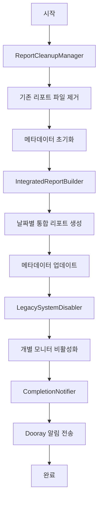

# Design Document

## Overview

POSCO 리포트 시스템을 완전히 초기화하고 통합 리포트 중심으로 재구성하는 시스템입니다. 기존의 개별 리포트 시스템(exchange-rate, kospi-close, newyork-market-watch)을 완전히 제거하고, 통합 리포트만을 생성하는 새로운 아키텍처로 전환합니다.

## Architecture

### 시스템 구성 요소

```
POSCO Report Reset System
├── ReportCleanupManager     # 기존 리포트 완전 제거
├── IntegratedReportBuilder  # 새로운 통합 리포트 생성
├── MetadataResetManager     # 메타데이터 초기화 및 재구성
├── LegacySystemDisabler     # 개별 리포트 시스템 비활성화
└── CompletionNotifier       # 작업 완료 알림
```

### 데이터 플로우



## Components and Interfaces

### 1. ReportCleanupManager

**목적**: 기존 모든 리포트 파일과 메타데이터를 완전히 제거

**주요 메서드**:
```python
class ReportCleanupManager:
    def cleanup_all_reports(self) -> Dict[str, int]
    def remove_html_files(self, directory: str) -> int
    def reset_metadata_files(self) -> bool
    def backup_existing_data(self) -> str
```

**처리 대상**:
- `docs/reports/*.html` - 모든 HTML 리포트 파일
- `Monitoring/Posco_News_mini/reports/*.html` - 로컬 리포트 파일
- `docs/reports_index.json` - 메타데이터 인덱스
- `Monitoring/docs/reports_index.json` - 로컬 메타데이터

### 2. IntegratedReportBuilder

**목적**: 7월 25일부터 현재까지 날짜별 통합 리포트 생성

**주요 메서드**:
```python
class IntegratedReportBuilder:
    def generate_date_range_reports(self, start_date: str, end_date: str) -> List[Dict]
    def create_realistic_news_data(self, date: str) -> Dict[str, Dict]
    def apply_weekday_scenario(self, date: str) -> Dict[str, str]
    def generate_single_integrated_report(self, date: str, news_data: Dict) -> Dict
```

**뉴스 데이터 생성 로직**:
- 요일별 시장 시나리오 적용
- 3개 뉴스 타입 (exchange-rate, kospi-close, newyork-market-watch) 통합
- 현실적인 감정 분석 (상승/하락/혼조/안정)
- 날짜별 고유한 컨텍스트 생성

### 3. MetadataResetManager

**목적**: 메타데이터 시스템 초기화 및 새로운 리포트 등록

**주요 메서드**:
```python
class MetadataResetManager:
    def reset_metadata_index(self) -> bool
    def register_integrated_report(self, report_info: Dict) -> bool
    def update_report_statistics(self) -> Dict
    def validate_metadata_integrity(self) -> bool
```

**메타데이터 구조**:
```json
{
  "lastUpdate": "2025-08-03T10:00:00Z",
  "totalReports": 6,
  "reports": [
    {
      "id": "posco_integrated_analysis_20250725",
      "filename": "posco_integrated_analysis_20250725.html",
      "title": "POSCO 뉴스 통합 분석 리포트",
      "type": "integrated",
      "date": "2025-07-25",
      "summary": {
        "newsCount": 3,
        "marketSentiment": "상승",
        "keyInsights": ["환율 안정", "증시 상승", "뉴욕 호조"]
      }
    }
  ]
}
```

### 4. LegacySystemDisabler

**목적**: 개별 리포트 생성 시스템 완전 비활성화

**주요 메서드**:
```python
class LegacySystemDisabler:
    def disable_individual_monitors(self) -> Dict[str, bool]
    def update_scheduler_config(self) -> bool
    def create_redirect_handlers(self) -> bool
    def validate_system_state(self) -> Dict[str, str]
```

**비활성화 대상**:
- `exchange_monitor.py` - 환율 개별 모니터
- `kospi_monitor.py` - 증시 개별 모니터  
- `newyork_monitor.py` - 뉴욕 개별 모니터
- 관련 스케줄러 설정

### 5. CompletionNotifier

**목적**: 작업 완료 알림 및 결과 요약

**주요 메서드**:
```python
class CompletionNotifier:
    def send_completion_notification(self, results: Dict) -> bool
    def generate_summary_report(self, results: Dict) -> str
    def create_dashboard_links(self) -> Dict[str, str]
    def format_dooray_message(self, summary: str) -> Dict
```

## Data Models

### ResetResults
```python
@dataclass
class ResetResults:
    removed_files_count: int
    generated_reports_count: int
    success_rate: float
    start_date: str
    end_date: str
    processing_time: float
    errors: List[str]
```

### IntegratedReportConfig
```python
@dataclass
class IntegratedReportConfig:
    date: str
    news_types: List[str]  # ['exchange-rate', 'kospi-close', 'newyork-market-watch']
    market_scenario: str   # '상승', '하락', '혼조', '안정'
    sentiment_weights: Dict[str, float]
```

## Error Handling

### 예외 처리 전략

1. **파일 제거 실패**
   - 개별 파일 제거 실패 시 로그 기록 후 계속 진행
   - 전체 디렉토리 접근 불가 시 백업 경로 시도

2. **리포트 생성 실패**
   - 특정 날짜 리포트 생성 실패 시 해당 날짜 스킵
   - 연속 실패 시 전체 프로세스 중단 및 롤백

3. **메타데이터 업데이트 실패**
   - 메타데이터 손상 시 백업에서 복원
   - JSON 파싱 오류 시 기본 구조로 재생성

4. **알림 전송 실패**
   - Dooray 웹훅 실패 시 로컬 로그에 결과 저장
   - 네트워크 오류 시 재시도 로직 적용

### 롤백 메커니즘

```python
class RollbackManager:
    def create_backup_snapshot(self) -> str
    def restore_from_backup(self, backup_id: str) -> bool
    def cleanup_backup_files(self, older_than_days: int) -> int
```

## Testing Strategy

### 단위 테스트

1. **ReportCleanupManager 테스트**
   - 파일 제거 기능 검증
   - 메타데이터 초기화 검증
   - 백업 생성 검증

2. **IntegratedReportBuilder 테스트**
   - 날짜별 리포트 생성 검증
   - 뉴스 데이터 생성 로직 검증
   - 요일별 시나리오 적용 검증

3. **MetadataResetManager 테스트**
   - 메타데이터 구조 검증
   - 리포트 등록 기능 검증
   - 데이터 무결성 검증

### 통합 테스트

1. **전체 프로세스 테스트**
   - 테스트 환경에서 전체 리셋 프로세스 실행
   - 생성된 리포트 품질 검증
   - 대시보드 연동 확인

2. **오류 시나리오 테스트**
   - 파일 권한 오류 시나리오
   - 네트워크 연결 실패 시나리오
   - 부분 실패 복구 시나리오

### 성능 테스트

1. **대용량 데이터 처리**
   - 100개 이상 리포트 제거 성능
   - 30일 이상 리포트 생성 성능
   - 메타데이터 업데이트 성능

## Security Considerations

1. **파일 시스템 보안**
   - 삭제 권한 검증
   - 경로 탐색 공격 방지
   - 백업 파일 암호화

2. **웹훅 보안**
   - Dooray 웹훅 URL 보호
   - 민감 정보 마스킹
   - 요청 검증

3. **데이터 무결성**
   - 메타데이터 체크섬 검증
   - 리포트 파일 무결성 확인
   - 백업 데이터 검증

## Deployment Strategy

### 단계별 배포

1. **Phase 1: 백업 및 검증**
   - 현재 시스템 상태 백업
   - 테스트 환경에서 검증

2. **Phase 2: 리셋 실행**
   - 기존 리포트 제거
   - 메타데이터 초기화

3. **Phase 3: 재생성**
   - 통합 리포트 생성
   - 메타데이터 업데이트

4. **Phase 4: 검증 및 알림**
   - 결과 검증
   - 완료 알림 전송

### 모니터링

- 프로세스 진행 상황 실시간 로깅
- 오류 발생 시 즉시 알림
- 성능 메트릭 수집 및 분석