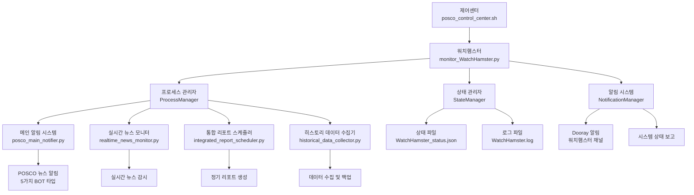

# Design Document

## Overview

POSCO 모니터링 시스템의 아키텍처를 올바른 계층 구조로 재설계합니다. 현재 시스템은 워치햄스터(WatchHamster)가 최상위 관리자 역할을 해야 하는데, 제어센터에서 개별 뉴스 알림 시스템을 직접 실행하는 잘못된 구조로 되어 있습니다.

새로운 아키텍처는 **제어센터 → 워치햄스터 → 하위 프로세스들** 의 올바른 계층 구조를 구현하여, 워치햄스터가 모든 하위 모니터링 프로세스를 통합 관리하도록 설계됩니다.

## Architecture

### Current Architecture (문제점)
```
제어센터 (posco_control_center.sh)
├── posco_main_notifier.py (직접 실행) ❌
├── 개별 뉴스 모니터들 (직접 실행) ❌
└── monitor_WatchHamster.py (별도 실행) ❌
```

### New Architecture (목표)
```
제어센터 (posco_control_center.sh)
└── 워치햄스터 (monitor_WatchHamster.py) ✅
    ├── 메인 알림 시스템 (posco_main_notifier.py)
    ├── 실시간 뉴스 모니터 (realtime_news_monitor.py)
    ├── 통합 리포트 스케줄러 (integrated_report_scheduler.py)
    ├── 히스토리 데이터 수집기 (historical_data_collector.py)
    └── 기타 확장 모듈들...
```

### System Flow Diagram



## Components and Interfaces

### 1. Enhanced WatchHamster (monitor_WatchHamster.py)

#### Core Responsibilities
- **프로세스 생명주기 관리**: 모든 하위 프로세스의 시작, 중지, 재시작
- **헬스체크 및 모니터링**: 5분 간격으로 하위 프로세스 상태 확인
- **자동 복구**: 프로세스 크래시 시 지능적 재시작 로직
- **통합 알림**: 전체 시스템 상태에 대한 포괄적 알림
- **설정 관리**: 동적 모듈 추가/제거 지원

#### New Class Structure
```python
class PoscoMonitorWatchHamster:
    def __init__(self):
        self.process_manager = ProcessManager()
        self.state_manager = StateManager()
        self.notification_manager = NotificationManager()
        self.module_registry = ModuleRegistry()
        
    # 프로세스 관리
    def start_all_processes(self)
    def stop_all_processes(self)
    def restart_process(self, process_name)
    def get_process_status(self, process_name)
    
    # 모듈 관리
    def register_module(self, module_config)
    def unregister_module(self, module_name)
    def reload_module_config(self)
    
    # 헬스체크
    def perform_health_check(self)
    def auto_recovery(self, failed_process)
    
    # 알림 관리
    def send_startup_notification(self)
    def send_status_report(self)
    def send_error_notification(self, error_info)
```

### 2. ProcessManager

하위 프로세스들의 생명주기를 관리하는 전용 클래스입니다.

```python
class ProcessManager:
    def __init__(self, script_dir):
        self.script_dir = script_dir
        self.processes = {}  # {name: subprocess.Popen}
        self.process_configs = {}  # {name: config_dict}
        
    def start_process(self, name, script_path, args=None)
    def stop_process(self, name, timeout=30)
    def restart_process(self, name)
    def is_process_running(self, name)
    def get_process_info(self, name)
    def kill_all_processes(self)
```

### 3. ModuleRegistry

동적 모듈 등록 및 관리를 위한 레지스트리 시스템입니다.

```python
class ModuleRegistry:
    def __init__(self, config_file=".naming_backup/config_data_backup/Monitoring/Posco_News_mini/.naming_backup/config_data_backup/Monitoring/Posco_News_mini/.naming_backup/config_data_backup/Monitoring/Posco_News_mini/.naming_backup/config_data_backup/Monitoring/Posco_News_mini/modules.json"):
        self.config_file = config_file
        self.modules = {}
        
    def load_config(self)
    def save_config(self)
    def register_module(self, name, config)
    def unregister_module(self, name)
    def get_module_config(self, name)
    def list_modules(self)
```

#### Module Configuration Format
```json
{
    "modules": {
        "posco_main_notifier": {
            "script": "Monitoring/POSCO_News_250808/Monitoring/POSCO_News_250808/Monitoring/POSCO_News_250808/Monitoring/POSCO_News_250808/posco_main_notifier.py",
            "description": "POSCO 메인 뉴스 알림 시스템",
            "auto_start": true,
            "restart_on_failure": true,
            "max_restart_attempts": 3,
            "health_check_interval": 300,
            "dependencies": []
        },
        "realtime_news_monitor": {
            "script": "Monitoring/POSCO_News_250808/Monitoring/POSCO_News_250808/Monitoring/POSCO_News_250808/Monitoring/POSCO_News_250808/realtime_news_monitor.py",
            "description": "실시간 뉴스 모니터링",
            "auto_start": true,
            "restart_on_failure": true,
            "max_restart_attempts": 3,
            "health_check_interval": 300,
            "dependencies": ["posco_main_notifier"]
        }
    }
}
```

### 4. Enhanced Control Center (posco_control_center.sh)

#### New Menu Structure
```bash
╔═══════════════════════════════════════════════════════════════════════════════╗
║                           🐹 워치햄스터 관리                                  ║
╠═══════════════════════════════════════════════════════════════════════════════╣
║  1. 🚀 워치햄스터 시작 (전체 시스템)
║     모든 POSCO 모니터링 시스템 통합 실행
║  2. 🛑 워치햄스터 중지 (전체 시스템)
║     모든 하위 프로세스 안전 종료
║  3. 🔄 워치햄스터 재시작
║     전체 시스템 재시작
║  4. 📊 워치햄스터 상태 확인
║     전체 시스템 상태 및 하위 프로세스 현황
╚═══════════════════════════════════════════════════════════════════════════════╝
╔═══════════════════════════════════════════════════════════════════════════════╗
║                           🔧 개별 모듈 관리 (고급)                            ║
╠═══════════════════════════════════════════════════════════════════════════════╣
║  A. 📋 개별 모듈 상태 확인
║  B. 🔄 특정 모듈 재시작
║  C. ➕ 새 모듈 등록
║  D. ➖ 모듈 제거
╚═══════════════════════════════════════════════════════════════════════════════╝
```

#### Control Flow Logic
```bash
function start_watchhamster() {
    # 1. 워치햄스터 실행 전 환경 체크
    check_prerequisites
    
    # 2. 기존 프로세스 정리
    cleanup_existing_processes
    
    # 3. 워치햄스터 시작
    start_watchhamster_process
    
    # 4. 워치햄스터가 하위 프로세스들을 자동 시작하도록 대기
    wait_for_system_initialization
    
    # 5. 전체 시스템 상태 확인 및 보고
    display_system_status
}
```

### 5. NotificationManager

워치햄스터의 통합 알림 시스템입니다.

```python
class NotificationManager:
    def __init__(self, webhook_url, bot_profile_url):
        self.webhook_url = webhook_url
        self.bot_profile_url = bot_profile_url
        
    def send_startup_notification(self, managed_processes)
    def send_shutdown_notification(self, shutdown_status)
    def send_status_report(self, system_status)
    def send_process_error(self, process_name, error_details)
    def send_recovery_success(self, process_name, recovery_details)
    def send_critical_alert(self, alert_message)
```

#### Enhanced Notification Templates

**시작 알림**
```
🐹 POSCO 워치햄스터 시스템 시작

📅 시작 시간: 2025-08-06 14:30:00
🛡️ 관리 대상 프로세스: 4개

📊 관리 중인 모듈:
  ✅ posco_main_notifier (메인 뉴스 알림)
  ✅ realtime_news_monitor (실시간 모니터링)  
  ✅ integrated_report_scheduler (리포트 스케줄러)
  ✅ historical_data_collector (데이터 수집기)

🔄 모니터링 설정:
  • 헬스체크: 5분 간격
  • 상태 보고: 2시간 간격
  • 자동 복구: 활성화
  • Git 업데이트: 60분 간격

🚀 전체 시스템이 정상적으로 초기화되었습니다.
```

**상태 보고 알림**
```
📊 POSCO 워치햄스터 정기 상태 보고

📅 보고 시간: 2025-08-06 15:00:00
⏱️ 가동 시간: 2시간 30분

🟢 정상 프로세스 (3/4):
  ✅ posco_main_notifier - 정상 (PID: 1234)
  ✅ realtime_news_monitor - 정상 (PID: 1235)
  ✅ integrated_report_scheduler - 정상 (PID: 1236)

🟡 문제 프로세스 (1/4):
  ⚠️ historical_data_collector - 재시작 중 (시도: 1/3)

📈 시스템 성능:
  • CPU 사용률: 15%
  • 메모리 사용률: 45%
  • 디스크 사용률: 23%

🔄 다음 상태 보고: 17:00
```

## Data Models

### 1. System Status Model
```python
@dataclass
class SystemStatus:
    timestamp: datetime
    uptime: timedelta
    total_processes: int
    running_processes: int
    failed_processes: int
    process_details: Dict[str, ProcessStatus]
    system_metrics: SystemMetrics
    last_git_update: datetime
    next_status_report: datetime
```

### 2. Process Status Model
```python
@dataclass
class ProcessStatus:
    name: str
    pid: Optional[int]
    status: str  # 'running', 'stopped', 'failed', 'restarting'
    start_time: Optional[datetime]
    last_health_check: datetime
    restart_count: int
    last_error: Optional[str]
    cpu_usage: float
    memory_usage: float
```

### 3. Module Configuration Model
```python
@dataclass
class ModuleConfig:
    name: str
    script_path: str
    description: str
    auto_start: bool
    restart_on_failure: bool
    max_restart_attempts: int
    health_check_interval: int
    dependencies: List[str]
    environment_vars: Dict[str, str]
    working_directory: Optional[str]
```

## Error Handling

### 1. Process Failure Recovery
```python
def handle_process_failure(self, process_name: str):
    """프로세스 실패 시 지능적 복구 로직"""
    
    # 1단계: 즉시 재시작 시도
    if self.restart_process(process_name):
        self.notification_manager.send_recovery_success(
            process_name, "1차 재시작 성공"
        )
        return True
    
    # 2단계: 5분 후 재시도
    time.sleep(300)
    if self.restart_process(process_name):
        self.notification_manager.send_recovery_success(
            process_name, "2차 재시작 성공"
        )
        return True
    
    # 3단계: 최종 재시도
    time.sleep(300)
    if self.restart_process(process_name):
        self.notification_manager.send_recovery_success(
            process_name, "3차 재시작 성공"
        )
        return True
    
    # 복구 실패 - 프로세스 비활성화 및 긴급 알림
    self.disable_process(process_name)
    self.notification_manager.send_critical_alert(
        f"🚨 {process_name} 복구 실패 - 수동 개입 필요"
    )
    return False
```

### 2. Communication Error Handling
```python
def handle_control_center_communication(self, command: str):
    """제어센터와의 통신 오류 처리"""
    try:
        result = self.execute_command(command)
        return {"status": "success", "result": result}
    except ProcessNotFoundError as e:
        return {"status": "error", "message": f"프로세스를 찾을 수 없습니다: {e}"}
    except PermissionError as e:
        return {"status": "error", "message": f"권한이 없습니다: {e}"}
    except Exception as e:
        return {"status": "error", "message": f"알 수 없는 오류: {e}"}
```

### 3. Configuration Error Handling
```python
def validate_module_config(self, config: ModuleConfig) -> List[str]:
    """모듈 설정 유효성 검사"""
    errors = []
    
    if not os.path.exists(config.script_path):
        errors.append(f"스크립트 파일이 존재하지 않습니다: {config.script_path}")
    
    for dep in config.dependencies:
        if dep not in self.module_registry.modules:
            errors.append(f"의존성 모듈이 등록되지 않았습니다: {dep}")
    
    if config.health_check_interval < 60:
        errors.append("헬스체크 간격은 최소 60초 이상이어야 합니다")
    
    return errors
```

## Testing Strategy

### 1. Unit Tests
- **ProcessManager 테스트**: 프로세스 시작/중지/재시작 로직
- **ModuleRegistry 테스트**: 모듈 등록/해제/설정 로드
- **NotificationManager 테스트**: 알림 전송 및 템플릿 렌더링
- **WatchHamster 테스트**: 헬스체크 및 자동 복구 로직

### 2. Integration Tests
- **제어센터-워치햄스터 통신 테스트**: 명령 전송 및 응답 검증
- **전체 시스템 시작/중지 테스트**: 모든 프로세스의 올바른 시작/종료
- **자동 복구 시나리오 테스트**: 프로세스 크래시 시 복구 동작
- **모듈 동적 추가/제거 테스트**: 런타임 모듈 관리

### 3. End-to-End Tests
- **전체 시스템 라이프사이클 테스트**: 시작부터 종료까지 전체 플로우
- **장애 시나리오 테스트**: 다양한 장애 상황에서의 시스템 동작
- **성능 테스트**: 다수의 모듈 관리 시 성능 및 안정성
- **알림 시스템 테스트**: 모든 알림 타입의 정상 전송 확인

### 4. Test Implementation Structure
```python
# tests/test_watchhamster.py
class TestWatchHamster:
    def test_process_startup(self)
    def test_process_health_check(self)
    def test_auto_recovery(self)
    def test_notification_sending(self)

# tests/test_process_manager.py  
class TestProcessManager:
    def test_start_process(self)
    def test_stop_process(self)
    def test_restart_process(self)
    def test_process_monitoring(self)

# tests/test_integration.py
class TestSystemIntegration:
    def test_control_center_communication(self)
    def test_full_system_lifecycle(self)
    def test_failure_recovery_scenarios(self)
```

이 설계는 워치햄스터를 중심으로 한 올바른 계층 구조를 구현하여, 안정적이고 확장 가능한 POSCO 모니터링 시스템을 제공합니다.