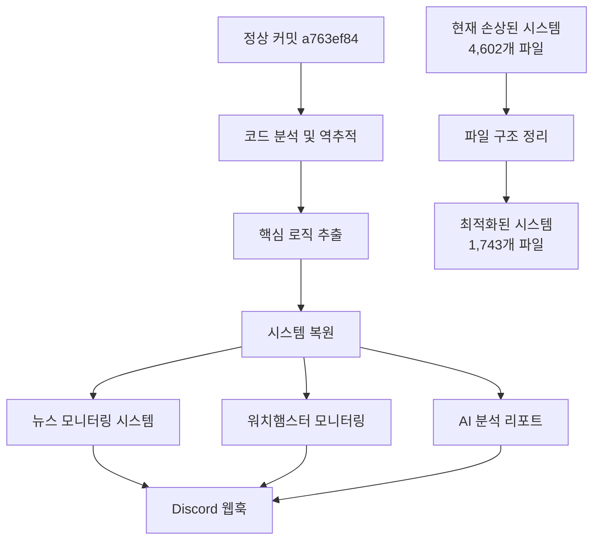
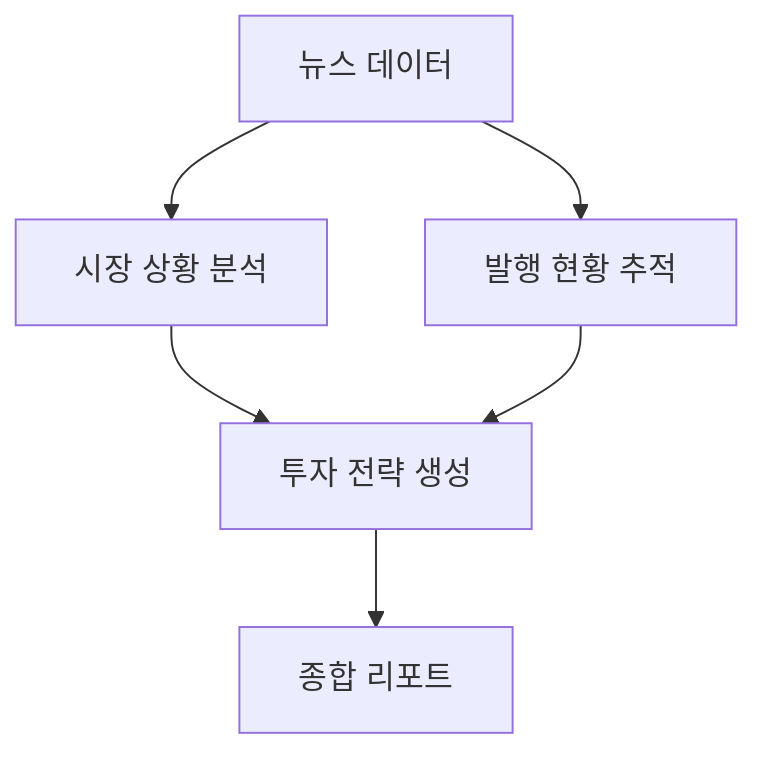

# POSCO 시스템 복구 설계 문서

## 개요

본 설계 문서는 손상된 POSCO 시스템을 정상 커밋 a763ef84be08b5b1dab0c0ba20594b141baec7ab 기준으로 완전 복구하기 위한 기술적 접근 방법을 정의합니다. 원본 로직을 역추적하여 기초부터 모든 기능을 복원하는 것이 목표입니다.

## 아키텍처

### 전체 시스템 아키텍처



### 복구 전략

1. **역추적 기반 복구**: 정상 커밋의 원본 코드를 분석하여 로직 추출
2. **점진적 복원**: 핵심 기능부터 단계별로 복원
3. **검증 기반 개발**: 캡처 이미지를 통한 결과 검증
4. **구조 최적화**: 불필요한 파일 제거 및 구조 정리

## 구성 요소 및 인터페이스

### 1. 코드 분석 모듈

**목적**: 정상 커밋의 원본 로직 분석 및 추출

**주요 기능**:
- Git 커밋 체크아웃 및 파일 분석
- 핵심 로직 식별 및 추출
- 의존성 관계 파악
- 설정 파일 및 환경 변수 분석

**인터페이스**:
```python
class CodeAnalyzer:
    def checkout_commit(self, commit_hash: str) -> bool
    def analyze_file_structure(self) -> Dict[str, Any]
    def extract_core_logic(self) -> Dict[str, str]
    def identify_dependencies(self) -> List[str]
```

### 2. 뉴스 모니터링 시스템

**목적**: INFOMAX API 기반 뉴스 데이터 수집 및 처리

**주요 기능**:
- INFOMAX API 연동
- 뉴스 데이터 파싱 및 상태 판단
- 데이터 부분 갱신 로직
- 시간 기반 상태 관리

**데이터 플로우**:


**인터페이스**:
```python
class NewsMonitor:
    def fetch_news_data(self) -> Dict[str, Any]
    def parse_market_watch(self, data: Dict) -> MarketData
    def parse_kospi_close(self, data: Dict) -> KospiData
    def parse_exchange_rate(self, data: Dict) -> ExchangeData
    def determine_status(self, data: Any) -> str
    def generate_webhook_message(self, data: Dict) -> str
```

### 3. 워치햄스터 모니터링 시스템

**목적**: 시스템 프로세스 감시 및 자동 복구

**주요 기능**:
- Git 업데이트 모니터링
- 프로세스 상태 감시
- 자동 복구 메커니즘
- 정기 상태 보고

**모니터링 대상**:
- Git 저장소 상태
- Python 프로세스 상태
- 시스템 리소스 (CPU, 메모리, 디스크)
- API 연결 상태

**인터페이스**:
```python
class WatchHamster:
    def monitor_git_status(self) -> GitStatus
    def monitor_process_status(self) -> ProcessStatus
    def monitor_system_resources(self) -> SystemResources
    def auto_recovery(self, issue: Issue) -> bool
    def generate_status_report(self) -> str
    def send_alert(self, alert_type: str, message: str) -> bool
```

### 4. AI 분석 리포트 시스템

**목적**: 수집된 데이터 기반 종합 분석 리포트 생성

**주요 기능**:
- 시장 종합 상황 분석
- 뉴스별 발행 현황 추적
- 투자 전략 가이드 생성
- 핵심 요약 제공

**분석 로직**:


**인터페이스**:
```python
class AIAnalyzer:
    def analyze_market_situation(self, data: Dict) -> MarketAnalysis
    def track_news_publication(self, data: Dict) -> PublicationStatus
    def generate_investment_strategy(self, analysis: MarketAnalysis) -> Strategy
    def create_comprehensive_report(self, components: Dict) -> str
```

### 5. 웹훅 전송 시스템

**목적**: Discord 웹훅을 통한 메시지 전송

**주요 기능**:
- 메시지 포맷팅
- 웹훅 전송
- 전송 실패 처리
- 메시지 타입별 라우팅

**메시지 타입**:
- 뉴스 알림 (🔔)
- 워치햄스터 알림 (❌, 🎯🛡️)
- AI 분석 리포트 (📊)
- 테스트 메시지 ([TEST])

**인터페이스**:
```python
class WebhookSender:
    def format_message(self, data: Dict, message_type: str) -> str
    def send_webhook(self, message: str, webhook_url: str) -> bool
    def handle_send_failure(self, error: Exception) -> bool
    def route_message(self, message_type: str) -> str
```

## 데이터 모델

### 1. 뉴스 데이터 모델

```python
@dataclass
class MarketData:
    title: str
    status: str  # "최신", "발행 전", "발행 지연"
    timestamp: datetime
    content: str
    source: str

@dataclass
class KospiData:
    status: str
    timestamp: Optional[datetime]
    title: Optional[str]
    value: Optional[float]

@dataclass
class ExchangeData:
    status: str
    timestamp: Optional[datetime]
    title: Optional[str]
    rate: Optional[float]
```

### 2. 시스템 상태 모델

```python
@dataclass
class SystemStatus:
    monitoring_process: str  # "정상 작동", "중단", "오류"
    api_connection: str      # "API 정상", "연결 실패"
    cpu_usage: float
    memory_usage: float
    disk_usage: float
    next_report_time: datetime
    auto_recovery_enabled: bool

@dataclass
class GitStatus:
    branch: str
    last_commit: str
    status: str  # "최신", "업데이트 필요", "충돌"
    error_message: Optional[str]
```

### 3. AI 분석 모델

```python
@dataclass
class MarketAnalysis:
    overall_situation: str   # "혼조", "상승", "하락"
    analyzed_sources: int
    completed_publications: int
    total_publications: int

@dataclass
class InvestmentStrategy:
    strategy_type: str       # "균형 전략", "공격적", "보수적"
    portfolio_allocation: Dict[str, float]
    expected_opportunities: List[str]
```

## 오류 처리

### 1. API 연결 오류

**시나리오**: INFOMAX API 연결 실패
**처리 방법**:
- 재시도 메커니즘 (최대 3회)
- 캐시된 데이터 사용
- 오류 알림 전송

### 2. Git 업데이트 오류

**시나리오**: Git 업데이트 중 충돌 발생
**처리 방법**:
- 자동 스태시 및 풀
- 충돌 해결 시도
- 수동 확인 요청 알림

### 3. 프로세스 중단 오류

**시나리오**: 모니터링 프로세스 중단
**처리 방법**:
- 자동 재시작 시도
- 상태 복구 확인
- 복구 완료 알림

### 4. 웹훅 전송 오류

**시나리오**: Discord 웹훅 전송 실패
**처리 방법**:
- 재전송 시도
- 로컬 로그 저장
- 대체 알림 방법 사용

## 테스트 전략

### 1. 단위 테스트

**대상**:
- 각 모듈의 핵심 기능
- 데이터 파싱 로직
- 상태 판단 알고리즘
- 메시지 생성 로직

### 2. 통합 테스트

**대상**:
- API 연동 테스트
- 웹훅 전송 테스트
- 전체 파이프라인 테스트
- 오류 처리 테스트

### 3. 검증 테스트

**방법**:
- 캡처 이미지와 결과 비교
- 메시지 포맷 검증
- 시간 정보 정확성 확인
- BOT 타입 선택 검증

### 4. 성능 테스트

**측정 항목**:
- API 응답 시간
- 메시지 생성 시간
- 웹훅 전송 시간
- 시스템 리소스 사용량

## 배포 및 운영

### 1. 파일 구조 최적화

**현재 상태**: 4,602개 파일
**목표 상태**: 1,743개 파일 (2,859개 파일 제거)

**제거 대상**:
- .backup, .repair, .migration 폴더
- 중복 파일 및 임시 파일
- 사용하지 않는 테스트 파일
- 과도한 로그 파일

### 2. 플랫폼별 실행 파일

**Windows (.bat)**:
- 🎛️POSCO_제어센터_실행.bat
- 🐹워치햄스터_총괄_관리_센터.bat
- 🚀POSCO_메인_알림_시작_직접.bat

**Mac (.sh/.command)**:
- 🎛️POSCO_제어센터_Mac실행.command
- 🚀POSCO_메인_알림_시작_직접.sh
- posco_control_mac.sh

### 3. 모니터링 및 유지보수

**모니터링 대상**:
- 시스템 가동 시간
- API 호출 성공률
- 웹훅 전송 성공률
- 오류 발생 빈도

**유지보수 계획**:
- 정기 로그 정리
- 성능 최적화
- 보안 업데이트
- 기능 개선

이 설계를 통해 정상 커밋의 원본 로직을 완전히 복원하고, 캡처 이미지와 동일한 결과를 자연스럽게 생성하는 안정적인 POSCO 시스템을 구축할 수 있습니다.