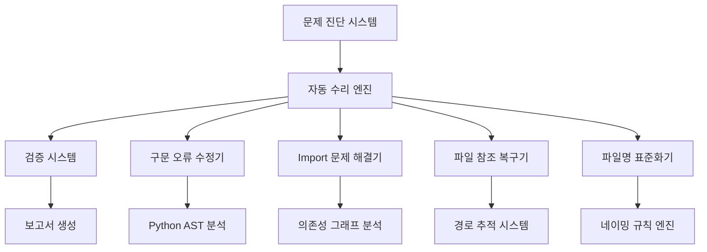
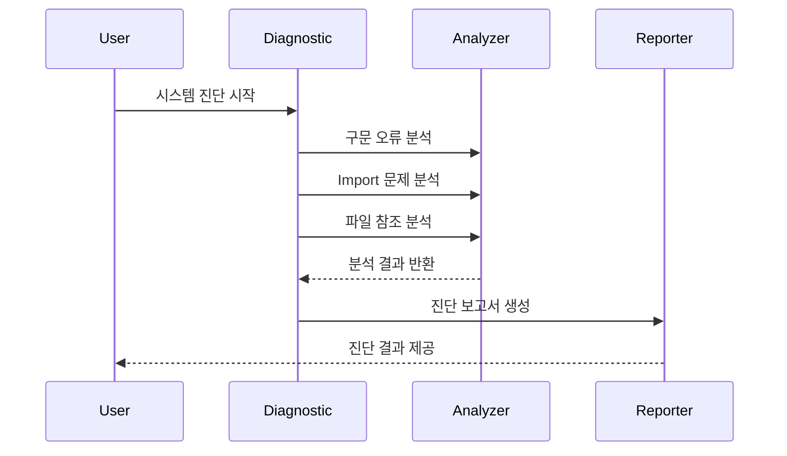
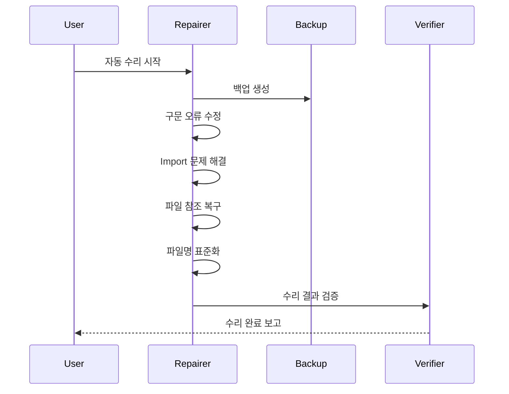
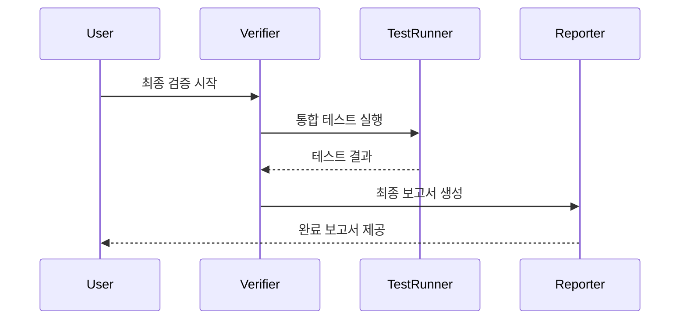

# POSCO 시스템 수리 및 완성 설계 문서

## 개요

최종 통합 테스트에서 발견된 모든 문제점들을 체계적으로 해결하여 POSCO 시스템을 완전히 작동 가능한 상태로 만드는 설계입니다.

## 아키텍처 개요



## 핵심 컴포넌트 설계

### 1. 문제 진단 시스템 (Problem Diagnostic System)

#### 1.1 구문 오류 진단기 (SyntaxErrorDiagnostic)
```python
class SyntaxErrorDiagnostic:
    """Python 파일의 구문 오류를 진단하는 클래스"""
    
    def diagnose_file(self, file_path: Path) -> DiagnosticResult:
        """개별 파일의 구문 오류 진단"""
        
    def diagnose_all_files(self) -> List[DiagnosticResult]:
        """모든 Python 파일의 구문 오류 진단"""
        
    def categorize_errors(self, results: List[DiagnosticResult]) -> Dict[str, List]:
        """오류 유형별 분류"""
```

**주요 기능**:
- Python AST 파싱을 통한 구문 오류 감지
- 오류 유형 분류 (f-string, 괄호, 들여쓰기 등)
- 수정 우선순위 결정

#### 1.2 Import 문제 진단기 (ImportDiagnostic)
```python
class ImportDiagnostic:
# BROKEN_REF:     """모듈 import 문제를 진단하는 클래스"""
    
    def analyze_dependencies(self) -> DependencyGraph:
        """모듈 간 의존성 그래프 생성"""
        
    def find_circular_imports(self) -> List[CircularImport]:
# BROKEN_REF:         """순환 import 감지"""
        
    def find_missing_modules(self) -> List[MissingModule]:
        """존재하지 않는 모듈 참조 감지"""
```

#### 1.3 파일 참조 진단기 (FileReferenceDiagnostic)
```python
class FileReferenceDiagnostic:
    """파일 참조 무결성을 진단하는 클래스"""
    
    def scan_file_references(self) -> List[FileReference]:
        """모든 파일 참조 스캔"""
        
    def validate_references(self) -> List[BrokenReference]:
        """깨진 참조 식별"""
        
    def suggest_fixes(self) -> List[ReferenceFix]:
        """수정 방안 제안"""
```

### 2. 자동 수리 엔진 (Auto Repair Engine)

#### 2.1 구문 오류 수정기 (SyntaxErrorRepairer)
```python
class SyntaxErrorRepairer:
    """Python 구문 오류를 자동으로 수정하는 클래스"""
    
    def repair_fstring_errors(self, file_path: Path) -> RepairResult:
        """f-string 구문 오류 수정"""
        
    def repair_bracket_mismatches(self, file_path: Path) -> RepairResult:
        """괄호 불일치 수정"""
        
    def repair_indentation_errors(self, file_path: Path) -> RepairResult:
        """들여쓰기 오류 수정"""
        
    def repair_all_syntax_errors(self, file_path: Path) -> RepairResult:
        """모든 구문 오류 종합 수정"""
```

**수정 전략**:
- **f-string 오류**: 잘못된 중괄호 사용 패턴 감지 및 수정
- **괄호 불일치**: 열린 괄호와 닫힌 괄호 매칭 검증 및 수정
- **들여쓰기**: Python 표준 4칸 들여쓰기 적용
- **변수명**: snake_case 규칙 적용

#### 2.2 Import 문제 해결기 (ImportRepairer)
```python
class ImportRepairer:
# BROKEN_REF:     """모듈 import 문제를 해결하는 클래스"""
    
    def fix_missing_imports(self, missing_modules: List[MissingModule]) -> RepairResult:
# BROKEN_REF:         """누락된 import 추가"""
        
    def resolve_circular_imports(self, circular_imports: List[CircularImport]) -> RepairResult:
# BROKEN_REF:         """순환 import 해결"""
        
    def update_import_paths(self, path_changes: Dict[str, str]) -> RepairResult:
# BROKEN_REF:         """파일 경로 변경에 따른 import 경로 업데이트"""
```

**해결 전략**:
# BROKEN_REF: - **누락된 import**: 사용된 모듈/함수 분석 후 필요한 import 추가
# BROKEN_REF: - **순환 import**: 공통 모듈 분리 또는 지연 import 적용
# BROKEN_REF: - **경로 업데이트**: 파일명 변경에 따른 모든 import 경로 자동 수정

#### 2.3 파일 참조 복구기 (FileReferenceRepairer)
```python
class FileReferenceRepairer:
    """파일 참조 무결성을 복구하는 클래스"""
    
    def repair_broken_references(self, broken_refs: List[BrokenReference]) -> RepairResult:
        """깨진 파일 참조 수정"""
        
    def update_path_references(self, path_mapping: Dict[str, str]) -> RepairResult:
        """경로 변경에 따른 참조 업데이트"""
        
    def standardize_path_format(self) -> RepairResult:
        """경로 표기법 표준화"""
```

**복구 전략**:
- **깨진 참조**: 유사한 이름의 실제 파일로 매핑 또는 참조 제거
- **경로 업데이트**: 파일 이동/이름 변경에 따른 모든 참조 자동 업데이트
- **경로 표준화**: 플랫폼 독립적 경로 표기법 적용

#### 2.4 파일명 표준화기 (FilenameStandardizer)
```python
class FilenameStandardizer:
    """파일명을 표준 규칙에 맞게 변경하는 클래스"""
    
    def standardize_python_files(self) -> StandardizationResult:
        """Python 파일명 표준화"""
        
    def standardize_script_files(self) -> StandardizationResult:
        """Shell/Batch 스크립트 파일명 표준화"""
        
    def standardize_document_files(self) -> StandardizationResult:
        """문서 파일명 표준화"""
        
    def update_all_references(self, name_changes: Dict[str, str]) -> UpdateResult:
        """파일명 변경에 따른 모든 참조 업데이트"""
```

**표준화 규칙**:
- **워치햄스터**: `WatchHamster_v3.0_*` 형식
- **포스코 뉴스**: `POSCO_News_250808_*` 형식
- **Python 파일**: snake_case 사용
- **문서 파일**: 이모지 + 설명적 이름

### 3. 검증 시스템 (Verification System)

#### 3.1 구문 검증기 (SyntaxVerifier)
```python
class SyntaxVerifier:
    """수정된 코드의 구문 정확성을 검증하는 클래스"""
    
    def verify_python_syntax(self, file_path: Path) -> VerificationResult:
        """Python 파일 구문 검증"""
        
    def verify_all_files(self) -> List[VerificationResult]:
        """모든 파일 구문 검증"""
        
    def run_compilation_test(self) -> CompilationResult:
        """컴파일 테스트 실행"""
```

#### 3.2 기능 검증기 (FunctionalityVerifier)
```python
class FunctionalityVerifier:
    """시스템 기능 정상 작동을 검증하는 클래스"""
    
    def verify_module_imports(self) -> ImportVerificationResult:
# BROKEN_REF:         """모듈 import 검증"""
        
    def verify_system_execution(self) -> ExecutionVerificationResult:
        """시스템 실행 검증"""
        
    def verify_webhook_functionality(self) -> WebhookVerificationResult:
        """웹훅 기능 검증 (내용 변경 없이)"""
```

#### 3.3 통합 검증기 (IntegrationVerifier)
```python
class IntegrationVerifier:
    """전체 시스템 통합 검증을 수행하는 클래스"""
    
    def run_integration_tests(self) -> IntegrationTestResult:
        """통합 테스트 실행"""
        
    def verify_performance(self) -> PerformanceResult:
        """성능 검증"""
        
    def generate_verification_report(self) -> VerificationReport:
        """검증 보고서 생성"""
```

### 4. 보고서 생성 시스템 (Reporting System)

#### 4.1 수리 보고서 생성기 (RepairReportGenerator)
```python
class RepairReportGenerator:
    """수리 작업 결과 보고서를 생성하는 클래스"""
    
    def generate_repair_summary(self) -> RepairSummary:
        """수리 작업 요약 생성"""
        
    def generate_detailed_report(self) -> DetailedReport:
        """상세 수리 보고서 생성"""
        
    def generate_before_after_comparison(self) -> ComparisonReport:
        """수리 전후 비교 보고서 생성"""
```

## 데이터 모델

### 진단 결과 모델
```python
@dataclass
class DiagnosticResult:
    file_path: Path
    error_type: str
    error_message: str
    line_number: int
    severity: str
    suggested_fix: Optional[str]

@dataclass
class BrokenReference:
    source_file: Path
    referenced_path: str
    reference_type: str  # 'import', 'file_path', 'config'
    line_number: int
    suggested_replacement: Optional[str]
```

### 수리 결과 모델
```python
@dataclass
class RepairResult:
    file_path: Path
    repair_type: str
    success: bool
    changes_made: List[str]
    backup_created: bool
    error_message: Optional[str]

@dataclass
class StandardizationResult:
    old_name: str
    new_name: str
    file_type: str
    references_updated: int
    success: bool
```

## 수리 워크플로우

### Phase 1: 진단 및 분석


### Phase 2: 자동 수리


### Phase 3: 검증 및 보고


## 안전장치 및 롤백 메커니즘

### 백업 시스템
```python
class BackupManager:
    """수리 작업 전 백업을 관리하는 클래스"""
    
    def create_full_backup(self) -> BackupResult:
        """전체 시스템 백업 생성"""
        
    def create_incremental_backup(self, files: List[Path]) -> BackupResult:
        """변경될 파일들만 백업"""
        
    def restore_from_backup(self, backup_id: str) -> RestoreResult:
        """백업에서 복원"""
```

### 롤백 시스템
```python
class RollbackManager:
    """수리 작업 롤백을 관리하는 클래스"""
    
    def create_rollback_point(self) -> RollbackPoint:
        """롤백 지점 생성"""
        
    def rollback_to_point(self, point: RollbackPoint) -> RollbackResult:
        """특정 지점으로 롤백"""
        
    def rollback_last_operation(self) -> RollbackResult:
        """마지막 작업 롤백"""
```

## 성능 고려사항

### 병렬 처리
- 파일별 구문 검사를 병렬로 수행
- 독립적인 수리 작업을 동시 실행
- 멀티프로세싱을 통한 성능 최적화

### 메모리 관리
- 대용량 파일 스트리밍 처리
- 메모리 사용량 모니터링
- 가비지 컬렉션 최적화

### 캐싱 전략
- 분석 결과 캐싱
- 파일 해시 기반 변경 감지
- 중복 작업 방지

## 보안 고려사항

### 웹훅 보안
- 웹훅 URL 암호화 저장
- API 키 보안 유지
- 민감 정보 로그 제외

### 파일 보안
- 파일 권한 보존
- 백업 파일 암호화
- 임시 파일 안전 삭제

## 확장성 설계

### 플러그인 아키텍처
```python
class RepairPlugin:
    """수리 플러그인 기본 인터페이스"""
    
    def can_handle(self, problem: Problem) -> bool:
        """문제 처리 가능 여부 확인"""
        
    def repair(self, problem: Problem) -> RepairResult:
        """문제 수리 실행"""
```

### 설정 관리
```python
class RepairConfiguration:
    """수리 작업 설정 관리"""
    
    repair_strategies: Dict[str, str]
    safety_checks: List[str]
    backup_settings: BackupSettings
    verification_rules: List[VerificationRule]
```

이 설계를 통해 체계적이고 안전한 시스템 수리가 가능하며, 모든 변경 사항이 추적 가능하고 롤백 가능합니다.