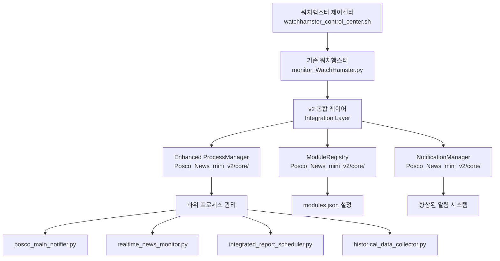

# Design Document

## Overview

POSCO 워치햄스터 v2.0 통합 및 테스트 프로젝트는 이미 구현된 v2 아키텍처 컴포넌트들을 기존 시스템과 실제로 통합하여 완전한 v2.0 시스템을 완성하는 것을 목표로 합니다.

현재 상태:
- ✅ v2 컴포넌트들이 `Monitoring/Posco_News_mini_v2/core/`에 구현됨
- ✅ 기존 워치햄스터가 `Monitoring/Posco_News_mini/monitor_WatchHamster.py`에 존재
- ⚠️ 두 시스템이 분리되어 있어 실제 통합 필요

## Architecture

### Integration Strategy



### Integration Approach

#### 1. Hybrid Architecture (하이브리드 아키텍처)
- 기존 워치햄스터 코드를 완전히 보존
- v2 컴포넌트들을 선택적으로 로드
- 초기화 실패 시 기존 방식으로 폴백

#### 2. Gradual Integration (점진적 통합)
- 단계별로 v2 기능을 활성화
- 각 단계에서 안정성 검증
- 문제 발생 시 이전 단계로 롤백

## Components and Interfaces

### 1. WatchHamster Integration Layer

기존 `PoscoMonitorWatchHamster` 클래스에 v2 통합 로직을 추가합니다.

```python
class PoscoMonitorWatchHamster:
    def __init__(self):
        # 기존 초기화 코드 유지
        self.script_dir = os.path.dirname(os.path.abspath(__file__))
        
        # v2 컴포넌트 초기화 시도
        self.v2_enabled = False
        self.process_manager = None
        self.module_registry = None
        self.notification_manager = None
        
        try:
            self._initialize_v2_components()
            self.v2_enabled = True
            print("🎉 v2 아키텍처 활성화 성공")
        except Exception as e:
            print(f"⚠️ v2 아키텍처 초기화 실패, 기존 방식 사용: {e}")
            self.v2_enabled = False
        
        # 기존 초기화 코드 계속...
    
    def _initialize_v2_components(self):
        """v2 컴포넌트 초기화"""
        sys.path.insert(0, os.path.join(self.script_dir, '..', 'Posco_News_mini_v2'))
        
        from core.enhanced_process_manager import ProcessManager
        from core.module_registry import ModuleRegistry
        from core.notification_manager import NotificationManager
        
        self.process_manager = ProcessManager(self.script_dir)
        self.module_registry = ModuleRegistry()
        self.notification_manager = NotificationManager(
            WATCHHAMSTER_WEBHOOK_URL, 
            BOT_PROFILE_IMAGE_URL
        )
        
        # 모듈 설정 로드
        self.module_registry.load_config()
```

### 2. Enhanced Control Center Functions

제어센터의 핵심 함수들을 실제로 구현합니다.

```bash
# watchhamster_control_center.sh

start_watchhamster() {
    clear
    print_header "🚀 워치햄스터 시작"
    
    # 1. 환경 체크
    echo -e "${INFO}🔍 시스템 환경 체크 중...${RESET}"
    
    if ! command -v python3 &> /dev/null; then
        print_error "Python3가 설치되지 않았습니다"
        return 1
    fi
    
    # 2. 기존 프로세스 정리
    echo -e "${INFO}🧹 기존 프로세스 정리 중...${RESET}"
    pkill -f "monitor_WatchHamster.py" 2>/dev/null || true
    sleep 2
    
    # 3. 워치햄스터 시작
    echo -e "${INFO}🐹 워치햄스터 시작 중...${RESET}"
    cd "Monitoring/Posco_News_mini"
    
    nohup python3 monitor_WatchHamster.py > ../../watchhamster.log 2>&1 &
    WATCHHAMSTER_PID=$!
    
    # 4. 초기화 대기
    echo -e "${INFO}⏳ 시스템 초기화 대기 중 (10초)...${RESET}"
    sleep 10
    
    # 5. 상태 확인
    if kill -0 $WATCHHAMSTER_PID 2>/dev/null; then
        print_success "워치햄스터 시작 성공 (PID: $WATCHHAMSTER_PID)"
        
        # 하위 프로세스 상태 확인
        echo -e "${INFO}📊 하위 프로세스 상태 확인 중...${RESET}"
        sleep 5
        
        check_managed_processes
    else
        print_error "워치햄스터 시작 실패"
        return 1
    fi
    
    echo
    read -p "계속하려면 Enter를 누르세요..."
}

check_watchhamster_status() {
    clear
    print_header "📊 워치햄스터 상태 확인"
    
    # 워치햄스터 프로세스 확인
    if pgrep -f "monitor_WatchHamster.py" > /dev/null; then
        WATCHHAMSTER_PID=$(pgrep -f "monitor_WatchHamster.py")
        print_success "🐹 워치햄스터가 실행 중입니다"
        echo -e "${INFO}  • PID: $WATCHHAMSTER_PID${RESET}"
        
        # 실행 시간 계산
        if command -v ps &> /dev/null; then
            UPTIME=$(ps -o etime= -p $WATCHHAMSTER_PID 2>/dev/null | tr -d ' ')
            echo -e "${INFO}  • 실행시간: $UPTIME${RESET}"
        fi
        
        # CPU/메모리 사용률
        if command -v ps &> /dev/null; then
            CPU_MEM=$(ps -o pcpu,pmem -p $WATCHHAMSTER_PID --no-headers 2>/dev/null)
            echo -e "${INFO}  • CPU/메모리: $CPU_MEM${RESET}"
        fi
        
        echo
        echo -e "${YELLOW}📊 관리 중인 모듈 상태${RESET}"
        check_managed_processes
        
    else
        print_error "🐹 워치햄스터가 실행되지 않고 있습니다"
        echo -e "${INFO}워치햄스터를 먼저 시작해주세요${RESET}"
    fi
    
    echo
    read -p "계속하려면 Enter를 누르세요..."
}

check_managed_processes() {
    local processes=("posco_main_notifier.py" "realtime_news_monitor.py" "integrated_report_scheduler.py")
    local running_count=0
    local total_count=${#processes[@]}
    
    for process in "${processes[@]}"; do
        if pgrep -f "$process" > /dev/null; then
            PID=$(pgrep -f "$process")
            print_success "  ✅ ${process%.*} (PID: $PID)"
            ((running_count++))
        else
            print_warning "  ❌ ${process%.*} (중지됨)"
        fi
    done
    
    echo
    if [ $running_count -eq $total_count ]; then
        print_success "🎯 모든 모듈이 정상 작동 중입니다 ($running_count/$total_count)"
    else
        print_warning "⚠️ 일부 모듈이 중지되어 있습니다 ($running_count/$total_count)"
    fi
}
```

### 3. Testing Framework

통합 테스트를 위한 테스트 프레임워크를 구현합니다.

```python
# test_v2_integration.py

import unittest
import subprocess
import time
import os
import sys
from datetime import datetime

class TestWatchHamsterV2Integration(unittest.TestCase):
    """워치햄스터 v2 통합 테스트"""
    
    def setUp(self):
        """테스트 설정"""
        self.script_dir = os.path.dirname(os.path.abspath(__file__))
        self.watchhamster_path = os.path.join(
            self.script_dir, 
            "Monitoring/Posco_News_mini/monitor_WatchHamster.py"
        )
        
    def test_v2_components_initialization(self):
        """v2 컴포넌트 초기화 테스트"""
        # 워치햄스터 임시 실행하여 v2 컴포넌트 로드 테스트
        result = subprocess.run([
            "python3", "-c", 
            f"""
import sys
sys.path.insert(0, '{self.script_dir}/Monitoring/Posco_News_mini')
from monitor_WatchHamster import PoscoMonitorWatchHamster
wh = PoscoMonitorWatchHamster()
print('v2_enabled:', wh.v2_enabled)
print('process_manager:', wh.process_manager is not None)
print('module_registry:', wh.module_registry is not None)
print('notification_manager:', wh.notification_manager is not None)
            """
        ], capture_output=True, text=True, timeout=30)
        
        self.assertEqual(result.returncode, 0)
        self.assertIn("v2_enabled: True", result.stdout)
    
    def test_control_center_functions(self):
        """제어센터 함수 테스트"""
        # 제어센터 스크립트 문법 검사
        result = subprocess.run([
            "bash", "-n", "watchhamster_control_center.sh"
        ], capture_output=True)
        
        self.assertEqual(result.returncode, 0, "제어센터 스크립트 문법 오류")
    
    def test_process_lifecycle(self):
        """프로세스 생명주기 테스트"""
        # 워치햄스터 시작
        process = subprocess.Popen([
            "python3", self.watchhamster_path
        ], stdout=subprocess.PIPE, stderr=subprocess.PIPE)
        
        try:
            # 초기화 대기
            time.sleep(10)
            
            # 프로세스가 실행 중인지 확인
            self.assertIsNone(process.poll(), "워치햄스터가 예상치 못하게 종료됨")
            
            # 하위 프로세스들이 시작되었는지 확인
            time.sleep(5)
            
            # 정상 종료
            process.terminate()
            process.wait(timeout=10)
            
        except subprocess.TimeoutExpired:
            process.kill()
            self.fail("프로세스 종료 타임아웃")
    
    def test_auto_recovery(self):
        """자동 복구 테스트"""
        # 이 테스트는 실제 환경에서만 의미가 있으므로 
        # 시뮬레이션으로 대체
        pass
    
    def test_migration_scripts(self):
        """마이그레이션 스크립트 테스트"""
        # 요구사항 체크 스크립트 테스트
        result = subprocess.run([
            "./check_migration_requirements.sh"
        ], capture_output=True, text=True)
        
        # 스크립트가 정상 실행되는지 확인 (실제 요구사항은 환경에 따라 다름)
        self.assertIn("요구사항 확인", result.stdout)

if __name__ == '__main__':
    unittest.main()
```

## Data Models

### Integration Status Model

```python
@dataclass
class IntegrationStatus:
    """통합 상태 정보"""
    v2_enabled: bool
    components_loaded: Dict[str, bool]
    fallback_reason: Optional[str]
    initialization_time: datetime
    performance_metrics: Dict[str, float]
```

### Test Results Model

```python
@dataclass
class TestResult:
    """테스트 결과"""
    test_name: str
    status: str  # 'passed', 'failed', 'skipped'
    execution_time: float
    error_message: Optional[str]
    details: Dict[str, Any]
```

## Error Handling

### Integration Failure Handling

```python
def safe_v2_integration():
    """안전한 v2 통합"""
    try:
        # v2 컴포넌트 로드 시도
        load_v2_components()
        return True, None
    except ImportError as e:
        return False, f"v2 컴포넌트 import 실패: {e}"
    except Exception as e:
        return False, f"v2 초기화 실패: {e}"

def fallback_to_v1():
    """v1 방식으로 폴백"""
    print("⚠️ v2 아키텍처 사용 불가, 기존 방식으로 동작합니다")
    # 기존 워치햄스터 로직 사용
```

## Testing Strategy

### 1. Unit Tests
- v2 컴포넌트 개별 기능 테스트
- 통합 레이어 로직 테스트
- 폴백 메커니즘 테스트

### 2. Integration Tests
- 워치햄스터-v2컴포넌트 통합 테스트
- 제어센터-워치햄스터 통신 테스트
- 전체 시스템 라이프사이클 테스트

### 3. End-to-End Tests
- 실제 사용 시나리오 테스트
- 자동 복구 시나리오 테스트
- 성능 및 안정성 테스트

### 4. Migration Tests
- 마이그레이션 스크립트 동작 테스트
- 롤백 기능 테스트
- 데이터 호환성 테스트

이 설계를 통해 기존 시스템의 안정성을 보장하면서 v2 아키텍처의 장점을 활용하는 완전한 통합 시스템을 구현할 수 있습니다.