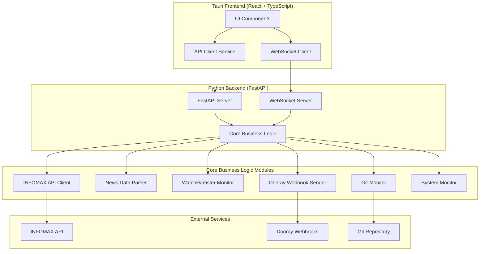
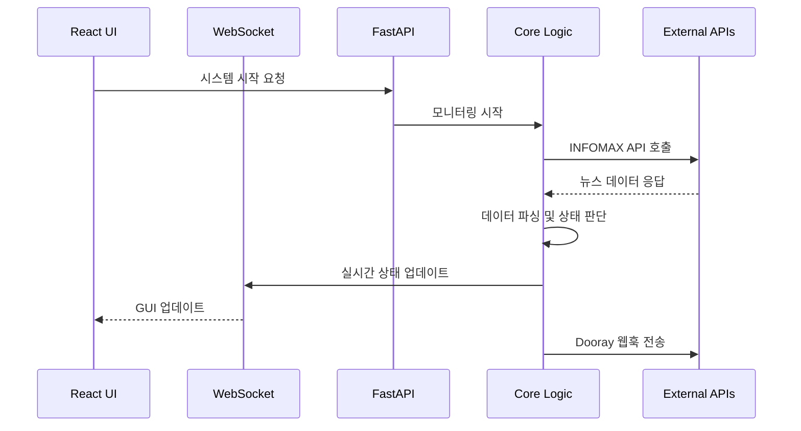

# WatchHamster Tauri 비즈니스 로직 구현 설계

## 📋 개요

기존 WatchHamster_Project의 완전한 비즈니스 로직을 WatchHamster_Project_GUI_Tauri에 통합하는 설계입니다. 현재 구현된 UI (Dashboard, Services, Logs, Settings)를 기반으로 하여 백엔드 로직을 완전히 이식하고, 필요시 UI를 보강합니다.

## 🏗️ 아키텍처

### 전체 시스템 아키텍처



### 데이터 플로우



## 🧩 구성요소 및 인터페이스

### 1. 백엔드 핵심 모듈 설계

#### 1.1 INFOMAX API 클라이언트 모듈
```python
# python-backend/core/infomax_client.py
class InfomaxAPIClient:
    """기존 infomax_api_client.py 로직 완전 이식"""
    
    def __init__(self, base_url: str, timeout: int = 30):
        self.base_url = base_url
        self.timeout = timeout
        self.session = None
    
    async def fetch_news_data(self, news_type: str) -> Dict[str, Any]:
        """뉴스 데이터 비동기 조회"""
        pass
    
    async def health_check(self) -> bool:
        """API 연결 상태 확인"""
        pass
```

#### 1.2 뉴스 데이터 파서 모듈
```python
# python-backend/core/news_parser.py
class NewsDataParser:
    """기존 news_data_parser.py + 개별 파서들 통합"""
    
    def __init__(self):
        self.exchange_rate_parser = ExchangeRateParser()
        self.newyork_parser = NewYorkMarketParser()
        self.kospi_parser = KospiCloseParser()
    
    async def parse_news_data(self, raw_data: Dict, news_type: str) -> NewsStatus:
        """뉴스 데이터 파싱 및 상태 판단"""
        pass
    
    def determine_news_status(self, parsed_data: Dict) -> NewsStatusEnum:
        """뉴스 상태 판단 (최신/지연/과거)"""
        pass
```

#### 1.3 WatchHamster 모니터 모듈
```python
# python-backend/core/watchhamster_monitor.py
class WatchHamsterMonitor:
    """기존 watchhamster_monitor.py 로직 완전 이식"""
    
    def __init__(self):
        self.git_monitor = GitMonitor()
        self.system_monitor = SystemMonitor()
        self.process_monitor = ProcessMonitor()
    
    async def start_monitoring(self):
        """전체 모니터링 시작"""
        pass
    
    async def get_system_status(self) -> SystemStatus:
        """시스템 전체 상태 조회"""
        pass
```

#### 1.4 Dooray 웹훅 모듈
```python
# python-backend/core/webhook_sender.py
class DoorayWebhookSender:
    """기존 웹훅 전송 로직 완전 이식"""
    
    def __init__(self):
        self.posco_webhook_url = "https://infomax.dooray.com/services/3262462484277387103/4121380745073081229/5FbudzTwTki4wCeBszBrAg"
        self.watchhamster_webhook_url = "https://infomax.dooray.com/services/3262462484277387103/3281274580264701322/nKUfZnjtRS2rHh-E9i9uZQ"
    
    async def send_posco_news_alert(self, news_data: NewsStatus):
        """POSCO 뉴스 알림 전송"""
        pass
    
    async def send_system_status_report(self, system_status: SystemStatus):
        """시스템 상태 보고서 전송"""
        pass
    
    def generate_dynamic_alert_message(self, data: Dict) -> str:
        """기존 generate_dynamic_alert_message 로직 이식"""
        pass
```

### 2. FastAPI 서버 설계

#### 2.1 메인 서버 구조
```python
# python-backend/main.py
from fastapi import FastAPI, WebSocket
from fastapi.middleware.cors import CORSMiddleware

app = FastAPI(title="WatchHamster Backend")

# WebSocket 연결 관리
class ConnectionManager:
    def __init__(self):
        self.active_connections: List[WebSocket] = []
    
    async def connect(self, websocket: WebSocket):
        await websocket.accept()
        self.active_connections.append(websocket)
    
    async def broadcast(self, message: dict):
        for connection in self.active_connections:
            await connection.send_json(message)

manager = ConnectionManager()
```

#### 2.2 API 엔드포인트 설계
```python
# python-backend/api/routes.py

# 시스템 제어 API
@app.post("/api/system/start")
async def start_system():
    """전체 시스템 시작"""
    pass

@app.post("/api/system/stop")
async def stop_system():
    """전체 시스템 중지"""
    pass

@app.get("/api/system/status")
async def get_system_status():
    """시스템 상태 조회"""
    pass

# 뉴스 모니터링 API
@app.get("/api/news/status")
async def get_news_status():
    """뉴스 상태 조회"""
    pass

@app.post("/api/news/refresh")
async def refresh_news_data():
    """뉴스 데이터 수동 갱신"""
    pass

# 설정 관리 API
@app.get("/api/settings")
async def get_settings():
    """설정 조회"""
    pass

@app.put("/api/settings")
async def update_settings(settings: SettingsModel):
    """설정 업데이트"""
    pass

# 로그 API
@app.get("/api/logs")
async def get_logs(limit: int = 100):
    """로그 조회"""
    pass

# WebSocket 엔드포인트
@app.websocket("/ws")
async def websocket_endpoint(websocket: WebSocket):
    """실시간 상태 업데이트"""
    await manager.connect(websocket)
    try:
        while True:
            # 실시간 데이터 전송
            await websocket.receive_text()
    except WebSocketDisconnect:
        manager.active_connections.remove(websocket)
```

### 3. 프론트엔드 서비스 레이어 설계

#### 3.1 API 서비스
```typescript
// src/services/api.ts
class APIService {
  private baseURL = 'http://localhost:8000/api';
  
  async startSystem(): Promise<void> {
    // 시스템 시작 API 호출
  }
  
  async stopSystem(): Promise<void> {
    // 시스템 중지 API 호출
  }
  
  async getSystemStatus(): Promise<SystemStatus> {
    // 시스템 상태 조회
  }
  
  async getNewsStatus(): Promise<NewsStatus[]> {
    // 뉴스 상태 조회
  }
  
  async updateSettings(settings: Settings): Promise<void> {
    // 설정 업데이트
  }
}
```

#### 3.2 WebSocket 서비스
```typescript
// src/services/websocket.ts
class WebSocketService {
  private ws: WebSocket | null = null;
  private listeners: Map<string, Function[]> = new Map();
  
  connect(): void {
    this.ws = new WebSocket('ws://localhost:8000/ws');
    
    this.ws.onmessage = (event) => {
      const data = JSON.parse(event.data);
      this.notifyListeners(data.type, data.payload);
    };
  }
  
  subscribe(eventType: string, callback: Function): void {
    // 이벤트 구독
  }
  
  private notifyListeners(eventType: string, data: any): void {
    // 리스너들에게 알림
  }
}
```

### 4. 기존 UI 페이지 보강 설계

#### 4.1 Dashboard 페이지 보강
```typescript
// src/pages/Dashboard.tsx 보강 사항
interface DashboardEnhancements {
  // 실시간 뉴스 상태 카드
  newsStatusCards: {
    exchangeRate: NewsStatusCard;
    newyorkMarket: NewsStatusCard;
    kospiClose: NewsStatusCard;
  };
  
  // 시스템 리소스 모니터링
  systemResources: {
    cpuUsage: number;
    memoryUsage: number;
    diskUsage: number;
  };
  
  // Git 상태 표시
  gitStatus: {
    currentBranch: string;
    lastCommit: string;
    hasConflicts: boolean;
  };
  
  // 실시간 알림 로그
  recentAlerts: Alert[];
}
```

#### 4.2 Services 페이지 보강
```typescript
// src/pages/Services.tsx 보강 사항
interface ServicesEnhancements {
  // 개별 서비스 제어
  services: {
    infomaxMonitor: ServiceControl;
    webhookSender: ServiceControl;
    gitMonitor: ServiceControl;
    systemMonitor: ServiceControl;
  };
  
  // 서비스 상태 실시간 표시
  serviceStatus: Map<string, ServiceStatus>;
  
  // 자동 재시작 설정
  autoRestartSettings: AutoRestartConfig;
}
```

#### 4.3 Settings 페이지 보강
```typescript
// src/pages/Settings.tsx 보강 사항
interface SettingsEnhancements {
  // API 설정
  apiSettings: {
    infomaxApiUrl: string;
    apiTimeout: number;
    retryAttempts: number;
  };
  
  // 웹훅 설정
  webhookSettings: {
    poscoWebhookUrl: string;
    watchhamsterWebhookUrl: string;
    webhookTimeout: number;
  };
  
  // 모니터링 설정
  monitoringSettings: {
    checkInterval: number;
    alertThresholds: AlertThresholds;
    quietHours: QuietHoursConfig;
  };
  
  // 설정 백업/복원
  configManagement: {
    exportConfig: () => void;
    importConfig: (file: File) => void;
    resetToDefaults: () => void;
  };
}
```

#### 4.4 Logs 페이지 보강
```typescript
// src/pages/Logs.tsx 보강 사항
interface LogsEnhancements {
  // 실시간 로그 스트리밍
  realTimeLogging: {
    isStreaming: boolean;
    autoScroll: boolean;
    maxLines: number;
  };
  
  // 로그 필터링
  logFilters: {
    logLevel: LogLevel[];
    dateRange: DateRange;
    searchQuery: string;
    source: LogSource[];
  };
  
  // 로그 내보내기
  logExport: {
    exportToFile: () => void;
    emailLogs: () => void;
  };
}
```

## 📊 데이터 모델

### 1. 뉴스 상태 모델
```typescript
interface NewsStatus {
  type: 'exchange-rate' | 'newyork-market-watch' | 'kospi-close';
  status: 'latest' | 'delayed' | 'outdated' | 'error';
  lastUpdate: Date;
  expectedTime: Date;
  delayMinutes: number;
  data: any;
  errorMessage?: string;
}
```

### 2. 시스템 상태 모델
```typescript
interface SystemStatus {
  overall: 'healthy' | 'warning' | 'critical';
  services: Map<string, ServiceStatus>;
  resources: SystemResources;
  gitStatus: GitStatus;
  lastCheck: Date;
}

interface ServiceStatus {
  name: string;
  status: 'running' | 'stopped' | 'error';
  pid?: number;
  uptime: number;
  restartCount: number;
}

interface SystemResources {
  cpu: ResourceUsage;
  memory: ResourceUsage;
  disk: ResourceUsage;
}

interface GitStatus {
  branch: string;
  lastCommit: string;
  hasUncommittedChanges: boolean;
  hasConflicts: boolean;
  remoteStatus: 'up-to-date' | 'ahead' | 'behind' | 'diverged';
}
```

### 3. 설정 모델
```typescript
interface Settings {
  api: APISettings;
  webhook: WebhookSettings;
  monitoring: MonitoringSettings;
  ui: UISettings;
}

interface APISettings {
  infomaxApiUrl: string;
  timeout: number;
  retryAttempts: number;
  retryDelay: number;
}

interface WebhookSettings {
  poscoWebhookUrl: string;
  watchhamsterWebhookUrl: string;
  timeout: number;
  retryAttempts: number;
}

interface MonitoringSettings {
  checkInterval: number;
  alertThresholds: {
    cpu: number;
    memory: number;
    disk: number;
  };
  quietHours: {
    enabled: boolean;
    startTime: string;
    endTime: string;
  };
}
```

## 🔄 오류 처리

### 1. API 연결 오류 처리
```python
class APIConnectionHandler:
    async def handle_connection_error(self, error: Exception):
        """API 연결 오류 처리"""
        # 1. 재시도 메커니즘
        # 2. 대체 엔드포인트 시도
        # 3. 오프라인 모드 전환
        # 4. 사용자 알림
        pass
    
    async def auto_recovery(self):
        """자동 복구 시도"""
        pass
```

### 2. 웹훅 전송 오류 처리
```python
class WebhookErrorHandler:
    async def handle_webhook_error(self, error: Exception, webhook_url: str):
        """웹훅 전송 오류 처리"""
        # 1. 재시도 큐에 추가
        # 2. 대체 알림 방법 시도
        # 3. 로컬 로그에 기록
        pass
```

### 3. 시스템 리소스 오류 처리
```python
class SystemResourceHandler:
    async def handle_resource_shortage(self, resource_type: str):
        """시스템 리소스 부족 처리"""
        # 1. 자동 정리 작업 수행
        # 2. 모니터링 간격 조정
        # 3. 비필수 기능 일시 중단
        pass
```

## 🧪 테스트 전략

### 1. 단위 테스트
- 각 핵심 모듈별 단위 테스트
- API 클라이언트 모킹 테스트
- 데이터 파서 정확성 테스트

### 2. 통합 테스트
- 백엔드-프론트엔드 통합 테스트
- WebSocket 실시간 통신 테스트
- 외부 API 연동 테스트

### 3. E2E 테스트
- 전체 워크플로우 테스트
- 사용자 시나리오 기반 테스트
- 장애 상황 시뮬레이션 테스트

## 🚀 배포 및 운영

### 1. 개발 환경 설정
```bash
# 백엔드 개발 서버 시작
cd python-backend
python -m uvicorn main:app --reload --port 8000

# 프론트엔드 개발 서버 시작
npm run tauri dev
```

### 2. 프로덕션 빌드
```bash
# Tauri 앱 빌드
npm run tauri build

# 백엔드 패키징
python -m PyInstaller main.py --onefile
```

### 3. 모니터링 및 로깅
- 구조화된 로깅 (JSON 형식)
- 로그 로테이션 자동화
- 성능 메트릭 수집
- 오류 추적 및 알림

## 📈 성능 최적화

### 1. 백엔드 최적화
- 비동기 처리 활용
- 연결 풀 관리
- 캐싱 전략 구현
- 메모리 사용량 최적화

### 2. 프론트엔드 최적화
- React 컴포넌트 최적화
- 상태 관리 효율화
- WebSocket 연결 관리
- 렌더링 성능 개선

### 3. 시스템 최적화
- 리소스 사용량 모니터링
- 자동 스케일링 메커니즘
- 가비지 컬렉션 최적화
- 디스크 I/O 최적화

## 🔒 보안 고려사항

### 1. API 보안
- API 키 안전한 저장
- HTTPS 통신 강제
- 요청 제한 (Rate Limiting)
- 입력 데이터 검증

### 2. 웹훅 보안
- 웹훅 URL 암호화 저장
- 전송 데이터 검증
- 재시도 공격 방지
- 로그에서 민감 정보 마스킹

### 3. 로컬 보안
- 설정 파일 암호화
- 로그 파일 접근 제한
- 임시 파일 안전한 처리
- 권한 최소화 원칙

이 설계를 바탕으로 기존 WatchHamster_Project의 모든 로직을 Tauri GUI에 완전히 통합하여 실제 작동하는 POSCO 뉴스 모니터링 시스템을 구축할 수 있습니다.