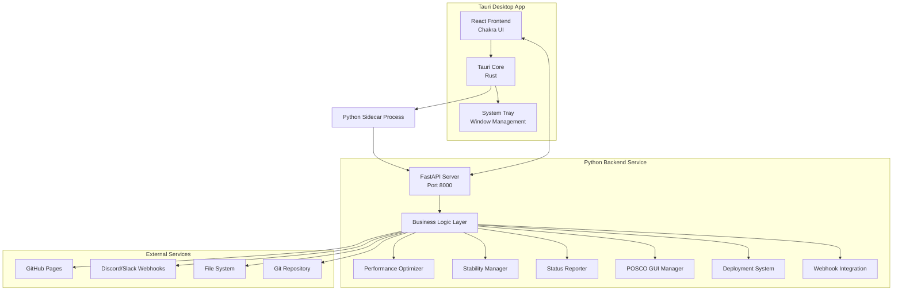

# WatchHamster Tauri UI 업그레이드 - 설계 문서

## 개요

기존 Tkinter 기반 WatchHamster GUI 시스템을 현대적인 Tauri + React + Chakra UI 아키텍처로 완전히 재구성합니다. 기존 Python 비즈니스 로직은 FastAPI 백엔드 서비스로 분리하고, 프론트엔드는 React + Chakra UI로 현대적인 웹 표준 UI를 구현합니다.

## 아키텍처

### 전체 시스템 아키텍처



### 프로젝트 구조

```
Monitoring/
├── WatchHamster_Project_GUI/           # 기존 Tkinter 버전 (보존)
└── WatchHamster_Project_GUI_Tauri/     # 새로운 Tauri 버전
    ├── README.md
    ├── package.json
    ├── tauri.conf.json
    ├── vite.config.ts
    ├── tsconfig.json
    ├── src-tauri/                      # Rust 백엔드
    │   ├── Cargo.toml
    │   ├── tauri.conf.json
    │   ├── src/
    │   │   ├── main.rs
    │   │   ├── commands.rs
    │   │   ├── python_bridge.rs
    │   │   └── system_tray.rs
    │   ├── icons/
    │   └── binaries/
    │       └── python-backend/         # Python 서비스 바이너리
    ├── src/                            # React 프론트엔드
    │   ├── main.tsx
    │   ├── App.tsx
    │   ├── theme.ts
    │   ├── components/
    │   │   ├── Layout/
    │   │   ├── Dashboard/
    │   │   ├── Services/
    │   │   ├── Logs/
    │   │   ├── Settings/
    │   │   └── Common/
    │   ├── pages/
    │   │   ├── Dashboard.tsx
    │   │   ├── Services.tsx
    │   │   ├── Logs.tsx
    │   │   └── Settings.tsx
    │   ├── hooks/
    │   │   ├── useWebSocket.ts
    │   │   ├── useServices.ts
    │   │   ├── useSystemMetrics.ts
    │   │   └── useServiceControl.ts
    │   ├── services/
    │   │   ├── api.ts
    │   │   ├── websocket.ts
    │   │   └── types.ts
    │   └── types/
    │       ├── system.ts
    │       ├── services.ts
    │       └── api.ts
    ├── python-backend/                 # Python FastAPI 서비스
    │   ├── main.py
    │   ├── requirements.txt
    │   ├── api/
    │   │   ├── __init__.py
    │   │   ├── services.py
    │   │   ├── metrics.py
    │   │   ├── webhooks.py
    │   │   └── websocket.py
    │   ├── core/                       # 기존 로직 포팅
    │   │   ├── __init__.py
    │   │   ├── performance_optimizer.py
    │   │   ├── stability_manager.py
    │   │   ├── status_reporter.py
    │   │   └── posco_manager.py
    │   ├── models/
    │   │   ├── __init__.py
    │   │   ├── system.py
    │   │   ├── services.py
    │   │   └── metrics.py
    │   └── utils/
    │       ├── __init__.py
    │       ├── config.py
    │       └── logger.py
    └── docs/
        ├── MIGRATION_GUIDE.md
        ├── API_REFERENCE.md
        └── DEVELOPMENT.md
```

## 컴포넌트 및 인터페이스

### 1. Tauri 백엔드 (Rust)

#### 주요 컴포넌트
- **main.rs**: 애플리케이션 진입점, 시스템 트레이 설정
- **commands.rs**: Tauri 명령어 정의 (Python 백엔드 통신)
- **python_bridge.rs**: Python 프로세스 관리
- **system_tray.rs**: 시스템 트레이 기능

#### 핵심 기능
```rust
// Tauri 명령어 인터페이스
#[tauri::command]
async fn start_python_backend() -> Result<String, String>

#[tauri::command]
async fn stop_python_backend() -> Result<String, String>

#[tauri::command]
async fn get_system_info() -> Result<SystemInfo, String>

#[tauri::command]
async fn send_webhook(payload: WebhookPayload) -> Result<String, String>
```

### 2. Python FastAPI 백엔드

#### API 엔드포인트 설계

```python
# 서비스 관리 API
GET    /api/services                    # 서비스 목록 조회
POST   /api/services/{service_id}/start # 서비스 시작
POST   /api/services/{service_id}/stop  # 서비스 중지
POST   /api/services/{service_id}/restart # 서비스 재시작

# 시스템 메트릭 API
GET    /api/metrics                     # 시스템 메트릭 조회
GET    /api/metrics/performance         # 성능 메트릭
GET    /api/metrics/stability           # 안정성 메트릭

# 웹훅 API
POST   /api/webhook/send                # 웹훅 전송
GET    /api/webhook/templates           # 메시지 템플릿 조회
POST   /api/webhook/templates           # 메시지 템플릿 생성

# 로그 API
GET    /api/logs                        # 로그 조회 (페이지네이션)
GET    /api/logs/stream                 # 실시간 로그 스트림

# POSCO 시스템 API
GET    /api/posco/status                # POSCO 시스템 상태
POST   /api/posco/deploy                # 배포 실행
POST   /api/posco/branch-switch         # 브랜치 전환

# WebSocket 엔드포인트
WS     /ws                              # 실시간 상태 업데이트
```

#### 데이터 모델

```python
# 서비스 모델
class ServiceInfo(BaseModel):
    id: str
    name: str
    description: str
    status: ServiceStatus  # running, stopped, error
    uptime: Optional[int]
    last_error: Optional[str]

# 시스템 메트릭 모델
class SystemMetrics(BaseModel):
    cpu_percent: float
    memory_percent: float
    disk_usage: float
    network_status: str
    uptime: int
    active_services: int

# WebSocket 메시지 모델
class WSMessage(BaseModel):
    type: str  # status_update, service_event, alert
    data: Dict[str, Any]
    timestamp: datetime
```

### 3. React 프론트엔드

#### 컴포넌트 계층 구조

```tsx
App
├── Layout
│   ├── Sidebar
│   ├── Header
│   └── MainContent
├── Pages
│   ├── Dashboard
│   │   ├── MetricCards
│   │   ├── RealtimeChart
│   │   └── ServiceStatusGrid
│   ├── Services
│   │   ├── ServiceCard
│   │   ├── ServiceControls
│   │   └── ServiceLogs
│   ├── Logs
│   │   ├── LogViewer
│   │   ├── LogFilters
│   │   └── LogExport
│   └── Settings
│       ├── GeneralSettings
│       ├── ThemeSettings
│       └── NotificationSettings
└── Common
    ├── LoadingSpinner
    ├── ErrorBoundary
    ├── Toast
    └── Modal
```

#### 상태 관리

```tsx
// React Query를 사용한 서버 상태 관리
const useServices = () => {
  return useQuery('services', () => api.getServices(), {
    refetchInterval: 5000,
    staleTime: 1000,
  })
}

// WebSocket을 통한 실시간 상태 업데이트
const useWebSocket = () => {
  const [socket, setSocket] = useState<WebSocket | null>(null)
  const [isConnected, setIsConnected] = useState(false)
  const [lastMessage, setLastMessage] = useState<WSMessage | null>(null)
  
  // WebSocket 연결 관리 로직
}
```

#### Chakra UI 테마 설정

```tsx
// 기존 POSCO 테마를 Chakra UI로 변환
const theme = extendTheme({
  colors: {
    posco: {
      50: '#f8f9fa',
      100: '#e9ecef',
      500: '#003d82',  // POSCO 메인 컬러
      900: '#212529',
    },
  },
  components: {
    Button: {
      variants: {
        posco: {
          bg: 'posco.500',
          color: 'white',
          _hover: { bg: 'posco.600' },
        },
      },
    },
  },
})
```

## 데이터 모델

### 시스템 상태 모델

```typescript
interface SystemStatus {
  performance: {
    cpu_percent: number
    memory_percent: number
    disk_usage: number
    network_status: 'connected' | 'disconnected' | 'limited'
    uptime: number
  }
  stability: {
    error_count: number
    recovery_count: number
    last_health_check: string
    system_health: 'healthy' | 'warning' | 'critical'
  }
  services: ServiceInfo[]
}

interface ServiceInfo {
  id: string
  name: string
  description: string
  status: 'running' | 'stopped' | 'error' | 'starting' | 'stopping'
  uptime?: number
  last_error?: string
  config?: Record<string, any>
}
```

### 실시간 통신 모델

```typescript
interface WebSocketMessage {
  type: 'status_update' | 'service_event' | 'alert' | 'log_update'
  data: any
  timestamp: string
}

interface ServiceEvent {
  service_id: string
  event_type: 'started' | 'stopped' | 'error' | 'restarted'
  message: string
  details?: Record<string, any>
}
```

## 오류 처리

### 계층별 오류 처리 전략

#### 1. Tauri 레이어
```rust
// Rust에서 Python 프로세스 오류 처리
pub fn handle_python_error(error: std::io::Error) -> String {
    match error.kind() {
        std::io::ErrorKind::NotFound => "Python 백엔드를 찾을 수 없습니다".to_string(),
        std::io::ErrorKind::PermissionDenied => "권한이 부족합니다".to_string(),
        _ => format!("알 수 없는 오류: {}", error),
    }
}
```

#### 2. Python 백엔드
```python
# FastAPI 전역 예외 처리
@app.exception_handler(Exception)
async def global_exception_handler(request: Request, exc: Exception):
    logger.error(f"Unhandled exception: {exc}", exc_info=True)
    return JSONResponse(
        status_code=500,
        content={"detail": "내부 서버 오류가 발생했습니다"}
    )

# 서비스별 오류 처리
class ServiceError(Exception):
    def __init__(self, service_id: str, message: str):
        self.service_id = service_id
        self.message = message
        super().__init__(f"Service {service_id}: {message}")
```

#### 3. React 프론트엔드
```tsx
// React Error Boundary
class ErrorBoundary extends React.Component {
  constructor(props) {
    super(props)
    this.state = { hasError: false, error: null }
  }

  static getDerivedStateFromError(error) {
    return { hasError: true, error }
  }

  componentDidCatch(error, errorInfo) {
    console.error('React Error Boundary:', error, errorInfo)
    // 오류 리포팅 서비스로 전송
  }

  render() {
    if (this.state.hasError) {
      return <ErrorFallback error={this.state.error} />
    }
    return this.props.children
  }
}

// API 오류 처리
const handleApiError = (error: AxiosError) => {
  if (error.response?.status === 500) {
    toast({
      title: '서버 오류',
      description: '잠시 후 다시 시도해주세요',
      status: 'error',
    })
  } else if (error.response?.status === 404) {
    toast({
      title: '서비스를 찾을 수 없습니다',
      status: 'warning',
    })
  }
}
```

## 테스팅 전략

### 1. 단위 테스트
- **Python 백엔드**: pytest를 사용한 API 엔드포인트 테스트
- **React 컴포넌트**: Jest + React Testing Library
- **Rust 코드**: cargo test

### 2. 통합 테스트
- **API 통합**: Python 백엔드와 React 프론트엔드 간 통신 테스트
- **WebSocket**: 실시간 통신 테스트
- **Tauri 통합**: Rust와 Python 간 프로세스 통신 테스트

### 3. E2E 테스트
- **Playwright**: 전체 사용자 플로우 테스트
- **시나리오**: 서비스 시작/중지, 배포 프로세스, 웹훅 전송 등

### 테스트 구조
```
tests/
├── unit/
│   ├── python/
│   │   ├── test_api.py
│   │   ├── test_services.py
│   │   └── test_websocket.py
│   ├── react/
│   │   ├── components/
│   │   ├── hooks/
│   │   └── services/
│   └── rust/
│       ├── test_commands.rs
│       └── test_python_bridge.rs
├── integration/
│   ├── test_api_integration.py
│   ├── test_websocket_integration.py
│   └── test_tauri_python.rs
└── e2e/
    ├── test_service_management.spec.ts
    ├── test_deployment_flow.spec.ts
    └── test_monitoring.spec.ts
```

## 성능 최적화

### 1. 프론트엔드 최적화
- **코드 분할**: React.lazy()를 사용한 페이지별 코드 분할
- **메모이제이션**: React.memo, useMemo, useCallback 적극 활용
- **가상화**: 대용량 로그 표시를 위한 react-window 사용
- **캐싱**: React Query의 캐싱 전략 활용

### 2. 백엔드 최적화
- **비동기 처리**: FastAPI의 async/await 활용
- **연결 풀링**: 데이터베이스 및 외부 API 연결 풀링
- **캐싱**: Redis 또는 메모리 캐싱 적용
- **배치 처리**: 대량 데이터 처리를 위한 배치 작업

### 3. 통신 최적화
- **WebSocket**: 실시간 데이터를 위한 효율적인 양방향 통신
- **압축**: gzip 압축을 통한 데이터 전송량 최적화
- **디바운싱**: 빈번한 API 호출 방지

## 보안 고려사항

### 1. Tauri 보안
- **CSP 설정**: Content Security Policy를 통한 XSS 방지
- **API 허용 목록**: 필요한 API만 선택적으로 활성화
- **파일 시스템 접근 제한**: 필요한 경로만 접근 허용

### 2. 백엔드 보안
- **CORS 설정**: 허용된 오리진만 접근 가능
- **입력 검증**: Pydantic을 통한 강력한 입력 검증
- **로깅**: 보안 이벤트 로깅 및 모니터링

### 3. 통신 보안
- **HTTPS**: 프로덕션 환경에서 HTTPS 강제
- **토큰 기반 인증**: JWT 또는 API 키를 통한 인증
- **레이트 리미팅**: API 호출 빈도 제한

이 설계는 기존 Tkinter 시스템의 모든 기능을 현대적인 웹 기술 스택으로 완전히 재구현하면서도, 성능과 사용자 경험을 대폭 개선하는 것을 목표로 합니다.