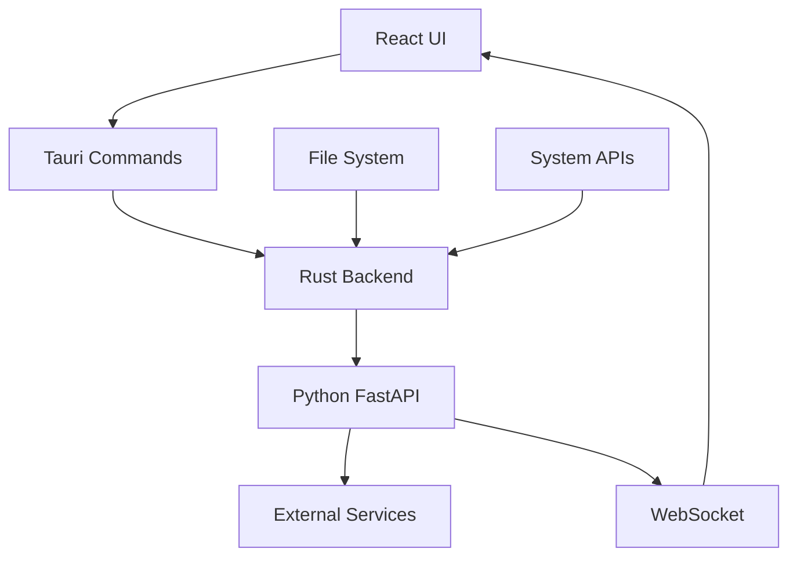

# WatchHamster Tauri 개발자 가이드

## 📋 목차

1. [개발 환경 설정](#개발-환경-설정)
2. [프로젝트 아키텍처](#프로젝트-아키텍처)
3. [개발 워크플로우](#개발-워크플로우)
4. [컴포넌트 개발](#컴포넌트-개발)
5. [API 개발](#api-개발)
6. [테스트 작성](#테스트-작성)
7. [빌드 및 배포](#빌드-및-배포)
8. [디버깅](#디버깅)
9. [성능 최적화](#성능-최적화)
10. [코딩 컨벤션](#코딩-컨벤션)
11. [기여 가이드](#기여-가이드)

## 🛠️ 개발 환경 설정

### 필수 요구사항

| 도구 | 최소 버전 | 권장 버전 | 용도 |
|------|-----------|-----------|------|
| **Node.js** | 18.0.0 | 20.x LTS | 프론트엔드 빌드 및 개발 서버 |
| **Rust** | 1.70.0 | 1.75+ | Tauri 백엔드 및 시스템 통합 |
| **Python** | 3.9.0 | 3.11+ | FastAPI 백엔드 서비스 |
| **Git** | 2.30+ | 최신 | 버전 관리 |

### 선택적 도구

| 도구 | 용도 | 설치 명령 |
|------|------|-----------|
| **Docker** | 컨테이너화된 개발 환경 | [공식 사이트](https://docker.com) |
| **VS Code** | 권장 IDE | [공식 사이트](https://code.visualstudio.com) |
| **Postman** | API 테스트 | [공식 사이트](https://postman.com) |

### 개발 도구 설치

#### Windows
```powershell
# Node.js (nvm 사용 권장)
nvm install 18
nvm use 18

# Rust
winget install Rustlang.Rustup

# Python
winget install Python.Python.3.11
```

#### macOS
```bash
# Node.js (nvm 사용 권장)
curl -o- https://raw.githubusercontent.com/nvm-sh/nvm/v0.39.0/install.sh | bash
nvm install 18
nvm use 18

# Rust
curl --proto '=https' --tlsv1.2 -sSf https://sh.rustup.rs | sh

# Python
brew install python@3.11
```

#### Linux (Ubuntu/Debian)
```bash
# Node.js
curl -fsSL https://deb.nodesource.com/setup_18.x | sudo -E bash -
sudo apt-get install -y nodejs

# Rust
curl --proto '=https' --tlsv1.2 -sSf https://sh.rustup.rs | sh

# Python
sudo apt update
sudo apt install python3.11 python3.11-pip
```

## 🏗️ 프로젝트 아키텍처

### 전체 구조 개요

WatchHamster Tauri는 3계층 아키텍처를 따릅니다:

1. **프레젠테이션 계층**: React + Chakra UI (사용자 인터페이스)
2. **애플리케이션 계층**: Tauri Rust (시스템 통합 및 보안)
3. **비즈니스 로직 계층**: Python FastAPI (핵심 기능 및 외부 연동)

### 디렉토리 구조

```
WatchHamster_Project_GUI_Tauri/
├── 📁 src/                           # React 프론트엔드
│   ├── 📁 components/                # 재사용 가능한 UI 컴포넌트
│   │   ├── 📁 Common/               # 공통 컴포넌트 (Modal, Toast 등)
│   │   ├── 📁 Layout/               # 레이아웃 컴포넌트 (Sidebar, Header)
│   │   ├── 📁 Dashboard/            # 대시보드 관련 컴포넌트
│   │   ├── 📁 Services/             # 서비스 관리 컴포넌트
│   │   ├── 📁 Logs/                 # 로그 뷰어 컴포넌트
│   │   └── 📁 Settings/             # 설정 컴포넌트
│   ├── 📁 pages/                    # 페이지 컴포넌트
│   │   ├── 📄 Dashboard.tsx         # 메인 대시보드
│   │   ├── 📄 Services.tsx          # 서비스 관리 페이지
│   │   ├── 📄 Logs.tsx              # 로그 뷰어 페이지
│   │   └── 📄 Settings.tsx          # 설정 페이지
│   ├── 📁 hooks/                    # 커스텀 React 훅
│   │   ├── 📄 useWebSocket.ts       # WebSocket 연결 관리
│   │   ├── 📄 useSystemMetrics.ts   # 시스템 메트릭 조회
│   │   ├── 📄 useServiceControl.ts  # 서비스 제어
│   │   └── 📄 useSettings.ts        # 설정 관리
│   ├── 📁 services/                 # API 서비스 레이어
│   │   ├── 📄 api.ts                # HTTP API 클라이언트
│   │   ├── 📄 websocket.ts          # WebSocket 클라이언트
│   │   ├── 📄 errorHandler.ts       # 오류 처리
│   │   └── 📄 queries.ts            # React Query 설정
│   ├── 📁 types/                    # TypeScript 타입 정의
│   │   ├── 📄 system.ts             # 시스템 관련 타입
│   │   ├── 📄 services.ts           # 서비스 관련 타입
│   │   └── 📄 api.ts                # API 관련 타입
│   ├── 📁 utils/                    # 유틸리티 함수
│   │   ├── 📄 formatters.ts         # 데이터 포맷팅
│   │   ├── 📄 validators.ts         # 입력 검증
│   │   └── 📄 constants.ts          # 상수 정의
│   ├── 📄 App.tsx                   # 메인 애플리케이션 컴포넌트
│   ├── 📄 main.tsx                  # React 진입점
│   └── 📄 theme.ts                  # Chakra UI 테마 설정
├── 📁 src-tauri/                    # Rust 백엔드 (Tauri)
│   ├── 📁 src/                      # Rust 소스 코드
│   │   ├── 📄 main.rs               # 애플리케이션 진입점
│   │   ├── 📄 commands.rs           # Tauri 명령어 정의
│   │   ├── 📄 python_bridge.rs     # Python 프로세스 관리
│   │   ├── 📄 window_manager.rs    # 창 관리
│   │   └── 📄 system_tray.rs       # 시스템 트레이
│   ├── 📁 icons/                    # 애플리케이션 아이콘
│   ├── 📄 Cargo.toml                # Rust 의존성 및 설정
│   └── 📄 tauri.conf.json           # Tauri 설정
├── 📁 python-backend/               # Python FastAPI 서비스
│   ├── 📄 main.py                   # FastAPI 애플리케이션 진입점
│   ├── 📁 api/                      # API 엔드포인트
│   │   ├── 📄 services.py           # 서비스 관리 API
│   │   ├── 📄 metrics.py            # 시스템 메트릭 API
│   │   ├── 📄 webhooks.py           # 웹훅 관리 API
│   │   ├── 📄 logs.py               # 로그 관리 API
│   │   ├── 📄 posco.py              # POSCO 시스템 API
│   │   └── 📄 websocket.py          # WebSocket 핸들러
│   ├── 📁 core/                     # 비즈니스 로직 (기존 코드 포팅)
│   │   ├── 📄 performance_optimizer.py
│   │   ├── 📄 stability_manager.py
│   │   ├── 📄 status_reporter.py
│   │   ├── 📄 posco_manager.py
│   │   └── 📄 webhook_system.py
│   ├── 📁 models/                   # 데이터 모델 (Pydantic)
│   │   ├── 📄 system.py             # 시스템 모델
│   │   ├── 📄 services.py           # 서비스 모델
│   │   └── 📄 webhooks.py           # 웹훅 모델
│   ├── 📁 utils/                    # 유틸리티
│   │   ├── 📄 config.py             # 설정 관리
│   │   ├── 📄 logger.py             # 로깅 시스템
│   │   └── 📄 middleware.py         # FastAPI 미들웨어
│   └── 📄 requirements.txt          # Python 의존성
├── 📁 docs/                         # 프로젝트 문서
│   ├── 📄 README.md                 # 프로젝트 개요
│   ├── 📄 DEVELOPMENT.md            # 개발 가이드
│   ├── 📄 ARCHITECTURE.md           # 아키텍처 문서
│   ├── 📄 API_REFERENCE.md          # API 참조
│   ├── 📄 USER_GUIDE.md             # 사용자 가이드
│   ├── 📄 MIGRATION_GUIDE.md        # 마이그레이션 가이드
│   ├── 📄 CONTRIBUTING.md           # 기여 가이드
│   └── 📄 FAQ.md                    # 자주 묻는 질문
├── 📁 tests/                        # 테스트 파일
│   ├── 📁 unit/                     # 단위 테스트
│   ├── 📁 integration/              # 통합 테스트
│   └── 📁 e2e/                      # E2E 테스트
├── 📄 package.json                  # Node.js 의존성 및 스크립트
├── 📄 vite.config.ts                # Vite 빌드 설정
├── 📄 tsconfig.json                 # TypeScript 설정
├── 📄 .eslintrc.js                  # ESLint 설정
├── 📄 .prettierrc                   # Prettier 설정
└── 📄 README.md                     # 프로젝트 루트 README
```

### 컴포넌트 간 통신 흐름



## 개발 워크플로우

### 1. 저장소 클론 및 설정

```bash
# 저장소 클론
git clone <repository-url>
cd WatchHamster_Project_GUI_Tauri

# 의존성 설치
npm install

# Python 백엔드 의존성 설치
cd python-backend
pip install -r requirements.txt
cd ..
```

### 2. 개발 서버 실행

```bash
# 전체 개발 서버 실행 (권장)
npm run dev

# 또는 개별 실행
# 프론트엔드만
npm run dev:frontend

# 백엔드만
npm run dev:backend
```

### 3. 코드 품질 관리

```bash
# 린팅
npm run lint
npm run lint:fix

# 타입 체크
npm run type-check

# 포맷팅
npm run format
npm run format:check

# 테스트
npm run test
npm run test:watch
```

## 컴포넌트 개발 가이드

### React 컴포넌트 작성

```tsx
// src/components/Example/ExampleComponent.tsx
import React from 'react'
import { Box, Text } from '@chakra-ui/react'

interface ExampleComponentProps {
  title: string
  description?: string
}

const ExampleComponent: React.FC<ExampleComponentProps> = ({ 
  title, 
  description 
}) => {
  return (
    <Box p={4} borderWidth="1px" borderRadius="md">
      <Text fontSize="lg" fontWeight="bold">
        {title}
      </Text>
      {description && (
        <Text fontSize="sm" color="gray.600" mt={2}>
          {description}
        </Text>
      )}
    </Box>
  )
}

export default ExampleComponent
```

### 커스텀 훅 작성

```tsx
// src/hooks/useExample.ts
import { useState, useEffect } from 'react'
import { useQuery } from '@tanstack/react-query'
import { apiService } from '@/services/api'

export const useExample = (id: string) => {
  const [isLoading, setIsLoading] = useState(false)

  const { data, error, refetch } = useQuery({
    queryKey: ['example', id],
    queryFn: () => apiService.getExample(id),
    enabled: !!id,
  })

  return {
    data,
    error,
    isLoading,
    refetch,
  }
}
```

## API 개발 가이드

### FastAPI 엔드포인트 작성

```python
# python-backend/api/example.py
from fastapi import APIRouter, HTTPException
from pydantic import BaseModel
from typing import List, Optional

router = APIRouter()

class ExampleModel(BaseModel):
    id: str
    name: str
    description: Optional[str] = None

@router.get("/examples", response_model=List[ExampleModel])
async def get_examples():
    """예제 목록 조회"""
    # 비즈니스 로직 구현
    return []

@router.post("/examples", response_model=ExampleModel)
async def create_example(example: ExampleModel):
    """새 예제 생성"""
    # 비즈니스 로직 구현
    return example
```

### Tauri 명령어 작성

```rust
// src-tauri/src/commands.rs
use tauri::command;
use serde::{Deserialize, Serialize};

#[derive(Debug, Serialize, Deserialize)]
pub struct ExampleData {
    pub id: String,
    pub value: String,
}

#[command]
pub async fn get_example_data(id: String) -> Result<ExampleData, String> {
    // 비즈니스 로직 구현
    Ok(ExampleData {
        id,
        value: "example".to_string(),
    })
}
```

## 테스트 작성

### React 컴포넌트 테스트

```tsx
// src/components/Example/__tests__/ExampleComponent.test.tsx
import { render, screen } from '@testing-library/react'
import { ChakraProvider } from '@chakra-ui/react'
import ExampleComponent from '../ExampleComponent'

const renderWithChakra = (component: React.ReactElement) => {
  return render(
    <ChakraProvider>
      {component}
    </ChakraProvider>
  )
}

describe('ExampleComponent', () => {
  it('renders title correctly', () => {
    renderWithChakra(
      <ExampleComponent title="Test Title" />
    )
    
    expect(screen.getByText('Test Title')).toBeInTheDocument()
  })
})
```

### Python API 테스트

```python
# python-backend/tests/test_example.py
import pytest
from fastapi.testclient import TestClient
from main import app

client = TestClient(app)

def test_get_examples():
    response = client.get("/api/examples")
    assert response.status_code == 200
    assert isinstance(response.json(), list)
```

## 빌드 및 배포

### 개발 빌드

```bash
# 프론트엔드 빌드
npm run build

# Tauri 개발 빌드
npm run tauri build -- --debug
```

### 프로덕션 빌드

```bash
# 전체 프로덕션 빌드
npm run build:tauri

# 특정 플랫폼용 빌드
npm run tauri build -- --target x86_64-pc-windows-msvc
```

## 디버깅

### 프론트엔드 디버깅

1. **브라우저 개발자 도구**: F12 키로 열기
2. **React DevTools**: 브라우저 확장 프로그램 설치
3. **Redux DevTools**: 상태 관리 디버깅

### 백엔드 디버깅

```python
# python-backend/main.py
import logging

# 디버그 로깅 활성화
logging.basicConfig(level=logging.DEBUG)

# 개발 모드로 실행
if __name__ == "__main__":
    uvicorn.run("main:app", host="127.0.0.1", port=8000, reload=True, log_level="debug")
```

### Tauri 디버깅

```rust
// src-tauri/src/main.rs
fn main() {
    // 개발 모드에서만 콘솔 창 표시
    #[cfg(debug_assertions)]
    {
        use tauri::Manager;
        // 디버그 정보 출력
        println!("Debug mode enabled");
    }
}
```

## 코딩 컨벤션

### TypeScript/React

- **파일명**: PascalCase (컴포넌트), camelCase (유틸리티)
- **컴포넌트**: 함수형 컴포넌트 사용
- **Props**: 인터페이스로 타입 정의
- **Hooks**: `use` 접두사 사용

### Python

- **파일명**: snake_case
- **클래스명**: PascalCase
- **함수명**: snake_case
- **상수**: UPPER_SNAKE_CASE

### Rust

- **파일명**: snake_case
- **구조체**: PascalCase
- **함수명**: snake_case
- **상수**: SCREAMING_SNAKE_CASE

## 성능 최적화

### React 최적화

```tsx
// 메모이제이션 사용
const MemoizedComponent = React.memo(({ data }) => {
  return <div>{data}</div>
})

// useMemo로 계산 최적화
const expensiveValue = useMemo(() => {
  return computeExpensiveValue(data)
}, [data])

// useCallback으로 함수 최적화
const handleClick = useCallback(() => {
  // 핸들러 로직
}, [dependency])
```

### Python 최적화

```python
# 비동기 처리 사용
async def get_data():
    async with httpx.AsyncClient() as client:
        response = await client.get("https://api.example.com")
        return response.json()

# 캐싱 사용
from functools import lru_cache

@lru_cache(maxsize=128)
def expensive_function(param):
    # 비용이 큰 계산
    return result
```

## 문제 해결

### 자주 발생하는 문제

1. **포트 충돌**: 8000번 포트가 이미 사용 중인 경우
2. **CORS 오류**: 프론트엔드와 백엔드 간 통신 문제
3. **빌드 오류**: 의존성 버전 충돌

### 해결 방법

```bash
# 포트 사용 확인
netstat -an | grep :8000

# 캐시 정리
npm cache clean --force
pip cache purge

# 의존성 재설치
rm -rf node_modules package-lock.json
npm install
```

## 기여 가이드

1. **브랜치 생성**: `feature/기능명` 또는 `fix/버그명`
2. **커밋 메시지**: 한국어로 명확하게 작성
3. **Pull Request**: 템플릿에 따라 작성
4. **코드 리뷰**: 최소 1명의 승인 필요

## 추가 리소스

- [Tauri 가이드](https://tauri.app/v1/guides/)
- [React 베스트 프랙티스](https://react.dev/learn)
- [FastAPI 튜토리얼](https://fastapi.tiangolo.com/tutorial/)
- [Chakra UI 컴포넌트](https://chakra-ui.com/docs/components)