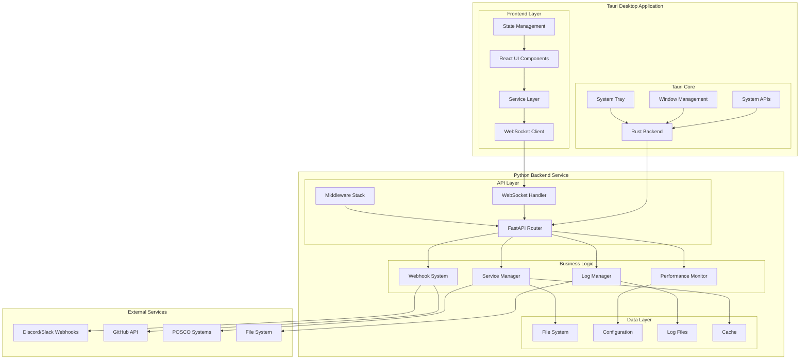
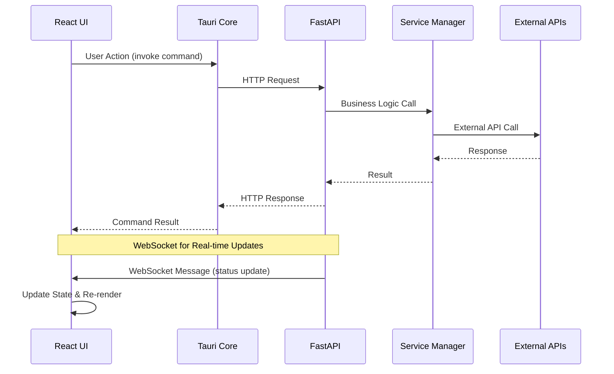
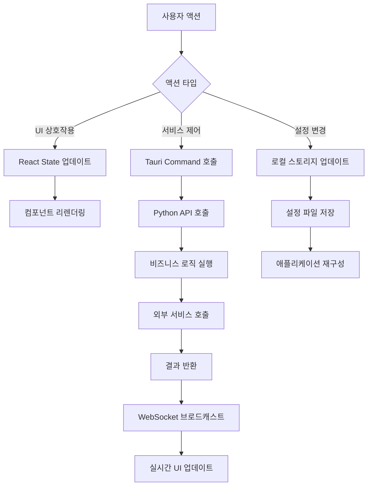
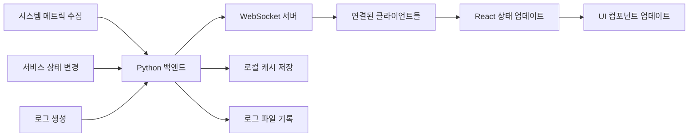
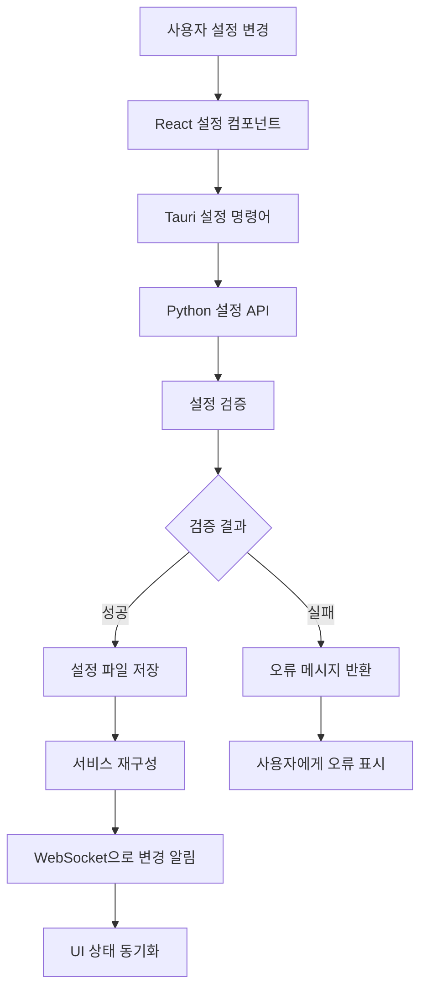
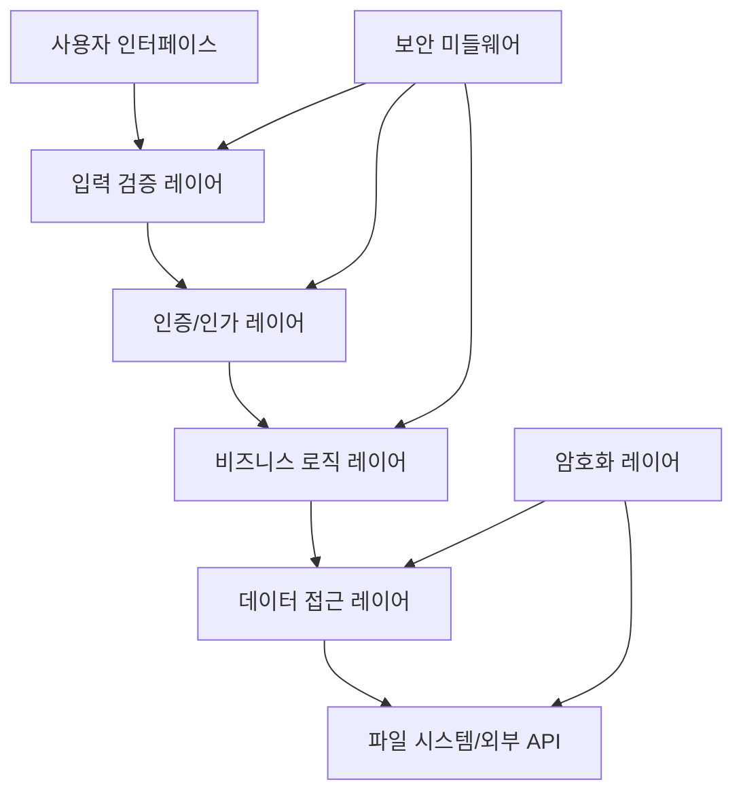

# WatchHamster Tauri 아키텍처 문서

## 📋 목차

1. [시스템 개요](#시스템-개요)
2. [아키텍처 다이어그램](#아키텍처-다이어그램)
3. [컴포넌트 구조](#컴포넌트-구조)
4. [데이터 플로우](#데이터-플로우)
5. [기술 스택](#기술-스택)
6. [디자인 패턴](#디자인-패턴)
7. [보안 아키텍처](#보안-아키텍처)
8. [성능 고려사항](#성능-고려사항)
9. [확장성 설계](#확장성-설계)

## 🏗️ 시스템 개요

WatchHamster Tauri는 기존 Tkinter 기반 모니터링 시스템을 현대적인 웹 기술 스택으로 재구성한 크로스 플랫폼 데스크톱 애플리케이션입니다.

### 핵심 설계 원칙

1. **관심사의 분리**: UI, 비즈니스 로직, 데이터 계층의 명확한 분리
2. **느슨한 결합**: 각 컴포넌트 간 독립성 보장
3. **높은 응집도**: 관련 기능들의 논리적 그룹화
4. **확장 가능성**: 플러그인 시스템을 통한 기능 확장
5. **성능 최적화**: 비동기 처리 및 효율적인 리소스 관리

### 주요 특징

- 🚀 **고성능**: Rust 네이티브 백엔드 + React 프론트엔드
- 🔄 **실시간**: WebSocket 기반 양방향 통신
- 🌐 **크로스 플랫폼**: Windows, macOS, Linux 지원
- 🔌 **확장 가능**: 플러그인 아키텍처
- 🛡️ **보안**: 다층 보안 모델

## 📊 아키텍처 다이어그램

### 전체 시스템 아키텍처



### 컴포넌트 간 통신 흐름



## 🧩 컴포넌트 구조

### 프론트엔드 아키텍처 (React)

```
src/
├── components/                 # 재사용 가능한 UI 컴포넌트
│   ├── Common/                # 공통 컴포넌트
│   │   ├── LoadingSpinner.tsx
│   │   ├── ErrorBoundary.tsx
│   │   ├── Modal.tsx
│   │   └── Toast.tsx
│   ├── Layout/                # 레이아웃 컴포넌트
│   │   ├── Sidebar.tsx
│   │   ├── Header.tsx
│   │   └── PageContainer.tsx
│   ├── Dashboard/             # 대시보드 컴포넌트
│   │   ├── MetricsGrid.tsx
│   │   ├── RealtimeChart.tsx
│   │   └── ServiceStatusGrid.tsx
│   ├── Services/              # 서비스 관리 컴포넌트
│   │   ├── ServiceCard.tsx
│   │   ├── ServiceControls.tsx
│   │   └── PoscoManagementPanel.tsx
│   ├── Logs/                  # 로그 뷰어 컴포넌트
│   │   ├── LogViewer.tsx
│   │   ├── LogFilter.tsx
│   │   └── VirtualizedLogViewer.tsx
│   └── Settings/              # 설정 컴포넌트
│       ├── GeneralSettings.tsx
│       ├── ThemeSettings.tsx
│       └── NotificationSettings.tsx
├── pages/                     # 페이지 컴포넌트
│   ├── Dashboard.tsx
│   ├── Services.tsx
│   ├── Logs.tsx
│   └── Settings.tsx
├── hooks/                     # 커스텀 React 훅
│   ├── useWebSocket.ts        # WebSocket 연결 관리
│   ├── useSystemMetrics.ts    # 시스템 메트릭 조회
│   ├── useServiceControl.ts   # 서비스 제어
│   └── useSettings.ts         # 설정 관리
├── services/                  # API 서비스 레이어
│   ├── api.ts                 # HTTP API 클라이언트
│   ├── websocket.ts           # WebSocket 클라이언트
│   ├── errorHandler.ts        # 오류 처리
│   └── queries.ts             # React Query 설정
├── types/                     # TypeScript 타입 정의
│   ├── system.ts              # 시스템 관련 타입
│   ├── services.ts            # 서비스 관련 타입
│   └── api.ts                 # API 관련 타입
└── utils/                     # 유틸리티 함수
    ├── formatters.ts          # 데이터 포맷팅
    ├── validators.ts          # 입력 검증
    └── constants.ts           # 상수 정의
```

### 백엔드 아키텍처 (Tauri + Python)

#### Tauri (Rust) 구조

```
src-tauri/src/
├── main.rs                    # 애플리케이션 진입점
├── commands.rs                # Tauri 명령어 정의
├── python_bridge.rs           # Python 프로세스 관리
├── window_manager.rs          # 창 관리
├── system_tray.rs             # 시스템 트레이
└── utils/
    ├── config.rs              # 설정 관리
    ├── logger.rs              # 로깅 시스템
    └── security.rs            # 보안 유틸리티
```

#### Python FastAPI 구조

```
python-backend/
├── main.py                    # FastAPI 애플리케이션 진입점
├── api/                       # API 엔드포인트
│   ├── services.py            # 서비스 관리 API
│   ├── metrics.py             # 메트릭 API
│   ├── webhooks.py            # 웹훅 API
│   ├── logs.py                # 로그 API
│   ├── posco.py               # POSCO 시스템 API
│   └── websocket.py           # WebSocket 핸들러
├── core/                      # 비즈니스 로직
│   ├── performance_optimizer.py
│   ├── stability_manager.py
│   ├── status_reporter.py
│   ├── posco_manager.py
│   └── webhook_system.py
├── models/                    # 데이터 모델
│   ├── system.py              # 시스템 모델
│   ├── services.py            # 서비스 모델
│   └── webhooks.py            # 웹훅 모델
└── utils/                     # 유틸리티
    ├── config.py              # 설정 관리
    ├── logger.py              # 로깅
    └── middleware.py          # 미들웨어
```

## 🔄 데이터 플로우

### 1. 사용자 인터랙션 플로우



### 2. 실시간 데이터 플로우



### 3. 설정 관리 플로우



## 🛠️ 기술 스택

### 프론트엔드 스택

| 기술 | 버전 | 용도 | 선택 이유 |
|------|------|------|-----------|
| **React** | 18.x | UI 프레임워크 | 컴포넌트 기반, 풍부한 생태계 |
| **TypeScript** | 5.x | 타입 시스템 | 타입 안전성, 개발 생산성 |
| **Chakra UI** | 2.x | UI 컴포넌트 라이브러리 | 접근성, 테마 시스템 |
| **React Query** | 4.x | 서버 상태 관리 | 캐싱, 동기화, 백그라운드 업데이트 |
| **Zustand** | 4.x | 클라이언트 상태 관리 | 간단함, 타입스크립트 지원 |
| **React Router** | 6.x | 라우팅 | SPA 네비게이션 |
| **Recharts** | 2.x | 차트 라이브러리 | React 네이티브, 커스터마이징 |
| **React Window** | 1.x | 가상화 | 대용량 데이터 성능 |

### 백엔드 스택

| 기술 | 버전 | 용도 | 선택 이유 |
|------|------|------|-----------|
| **Tauri** | 1.x | 데스크톱 프레임워크 | 네이티브 성능, 보안, 크로스 플랫폼 |
| **Rust** | 1.75+ | 시스템 프로그래밍 | 메모리 안전성, 성능, 동시성 |
| **FastAPI** | 0.104+ | 웹 프레임워크 | 비동기 지원, 자동 문서화, 타입 힌트 |
| **Python** | 3.11+ | 비즈니스 로직 | 기존 코드 호환성, 풍부한 라이브러리 |
| **Pydantic** | 2.x | 데이터 검증 | 타입 안전성, 자동 검증 |
| **Uvicorn** | 0.24+ | ASGI 서버 | 고성능, 비동기 지원 |
| **WebSockets** | - | 실시간 통신 | 양방향 통신, 낮은 지연시간 |

### 개발 도구

| 도구 | 용도 |
|------|------|
| **Vite** | 빌드 도구 및 개발 서버 |
| **ESLint** | JavaScript/TypeScript 린팅 |
| **Prettier** | 코드 포맷팅 |
| **Jest** | JavaScript 테스트 프레임워크 |
| **pytest** | Python 테스트 프레임워크 |
| **Cargo** | Rust 패키지 관리자 |

## 🎨 디자인 패턴

### 1. 프론트엔드 패턴

#### Container-Presenter 패턴

```typescript
// Container Component (로직 담당)
const DashboardContainer: React.FC = () => {
  const { data, loading, error } = useSystemMetrics();
  const { services } = useServices();
  
  return (
    <DashboardPresenter
      metrics={data}
      services={services}
      loading={loading}
      error={error}
    />
  );
};

// Presenter Component (UI 담당)
const DashboardPresenter: React.FC<DashboardProps> = ({
  metrics,
  services,
  loading,
  error
}) => {
  if (loading) return <LoadingSpinner />;
  if (error) return <ErrorMessage error={error} />;
  
  return (
    <Grid>
      <MetricsGrid metrics={metrics} />
      <ServiceGrid services={services} />
    </Grid>
  );
};
```

#### Custom Hook 패턴

```typescript
// 비즈니스 로직을 캡슐화한 커스텀 훅
const useServiceControl = (serviceId: string) => {
  const [isLoading, setIsLoading] = useState(false);
  const queryClient = useQueryClient();
  
  const startService = useCallback(async () => {
    setIsLoading(true);
    try {
      await invoke('start_service', { serviceId });
      queryClient.invalidateQueries(['services']);
    } finally {
      setIsLoading(false);
    }
  }, [serviceId, queryClient]);
  
  return { startService, isLoading };
};
```

### 2. 백엔드 패턴

#### Repository 패턴

```python
# 추상 인터페이스
class ServiceRepository(ABC):
    @abstractmethod
    async def get_all(self) -> List[Service]:
        pass
    
    @abstractmethod
    async def get_by_id(self, service_id: str) -> Optional[Service]:
        pass

# 구체적인 구현
class FileServiceRepository(ServiceRepository):
    async def get_all(self) -> List[Service]:
        # 파일 시스템에서 서비스 정보 로드
        pass
```

#### Factory 패턴

```python
class ServiceFactory:
    @staticmethod
    def create_service(service_type: str, config: dict) -> Service:
        if service_type == "posco_news":
            return PoscoNewsService(config)
        elif service_type == "github_pages":
            return GitHubPagesService(config)
        else:
            raise ValueError(f"Unknown service type: {service_type}")
```

#### Observer 패턴 (WebSocket)

```python
class WebSocketManager:
    def __init__(self):
        self.connections: List[WebSocket] = []
        self.observers: List[Observer] = []
    
    def add_observer(self, observer: Observer):
        self.observers.append(observer)
    
    async def notify_all(self, message: dict):
        for connection in self.connections:
            await connection.send_json(message)
```

### 3. Tauri 패턴

#### Command 패턴

```rust
// 명령어 인터페이스 정의
#[tauri::command]
async fn execute_service_action(
    action: ServiceAction,
    service_id: String
) -> Result<String, String> {
    match action {
        ServiceAction::Start => start_service(service_id).await,
        ServiceAction::Stop => stop_service(service_id).await,
        ServiceAction::Restart => restart_service(service_id).await,
    }
}
```

## 🔒 보안 아키텍처

### 1. 다층 보안 모델



### 2. 보안 구성 요소

#### 입력 검증

```typescript
// 프론트엔드 검증
const validateWebhookUrl = (url: string): boolean => {
  const urlPattern = /^https?:\/\/.+/;
  return urlPattern.test(url) && url.length < 2048;
};

// 백엔드 검증 (Pydantic)
class WebhookRequest(BaseModel):
    url: HttpUrl
    message: str = Field(..., min_length=1, max_length=2000)
    webhook_type: Literal["discord", "slack", "custom"]
```

#### 데이터 암호화

```rust
// Tauri에서 민감한 데이터 암호화
use aes_gcm::{Aes256Gcm, Key, Nonce};

pub fn encrypt_sensitive_data(data: &str, key: &[u8]) -> Result<Vec<u8>, String> {
    let cipher = Aes256Gcm::new(Key::from_slice(key));
    let nonce = Nonce::from_slice(b"unique nonce");
    
    cipher.encrypt(nonce, data.as_bytes())
        .map_err(|e| format!("Encryption failed: {}", e))
}
```

#### 접근 제어

```python
# API 엔드포인트 보호
from functools import wraps

def require_admin(func):
    @wraps(func)
    async def wrapper(*args, **kwargs):
        # 관리자 권한 확인 로직
        if not is_admin_user():
            raise HTTPException(status_code=403, detail="Admin required")
        return await func(*args, **kwargs)
    return wrapper

@router.post("/admin/services/{service_id}/force-stop")
@require_admin
async def force_stop_service(service_id: str):
    # 강제 중지 로직
    pass
```

### 3. 보안 설정

#### CSP (Content Security Policy)

```json
{
  "tauri": {
    "security": {
      "csp": "default-src 'self'; connect-src 'self' ws://localhost:8000; img-src 'self' data: https:; style-src 'self' 'unsafe-inline'"
    }
  }
}
```

#### CORS 설정

```python
from fastapi.middleware.cors import CORSMiddleware

app.add_middleware(
    CORSMiddleware,
    allow_origins=["tauri://localhost", "http://localhost:1420"],
    allow_credentials=True,
    allow_methods=["GET", "POST", "PUT", "DELETE"],
    allow_headers=["*"],
)
```

## ⚡ 성능 고려사항

### 1. 프론트엔드 최적화

#### 코드 분할

```typescript
// 페이지별 코드 분할
const Dashboard = lazy(() => import('./pages/Dashboard'));
const Services = lazy(() => import('./pages/Services'));
const Logs = lazy(() => import('./pages/Logs'));

// 컴포넌트 레벨 분할
const HeavyChart = lazy(() => import('./components/HeavyChart'));
```

#### 메모이제이션

```typescript
// React.memo로 불필요한 리렌더링 방지
const ServiceCard = React.memo<ServiceCardProps>(({ service }) => {
  return <Card>{service.name}</Card>;
});

// useMemo로 계산 최적화
const chartData = useMemo(() => {
  return processMetricsData(rawMetrics);
}, [rawMetrics]);
```

#### 가상화

```typescript
// 대용량 로그 데이터 가상화
import { FixedSizeList as List } from 'react-window';

const LogViewer: React.FC = ({ logs }) => (
  <List
    height={600}
    itemCount={logs.length}
    itemSize={35}
    itemData={logs}
  >
    {LogRow}
  </List>
);
```

### 2. 백엔드 최적화

#### 비동기 처리

```python
# 비동기 I/O로 성능 향상
async def get_system_metrics():
    async with aiohttp.ClientSession() as session:
        tasks = [
            get_cpu_usage(),
            get_memory_usage(),
            get_disk_usage(),
            get_network_stats()
        ]
        return await asyncio.gather(*tasks)
```

#### 캐싱

```python
from functools import lru_cache
import asyncio

# 메모리 캐싱
@lru_cache(maxsize=128)
def get_service_config(service_id: str) -> dict:
    return load_config_from_file(service_id)

# 비동기 캐싱
class AsyncCache:
    def __init__(self):
        self._cache = {}
        self._lock = asyncio.Lock()
    
    async def get_or_set(self, key: str, factory):
        async with self._lock:
            if key not in self._cache:
                self._cache[key] = await factory()
            return self._cache[key]
```

#### 연결 풀링

```python
# HTTP 클라이언트 연결 풀
import aiohttp

class HTTPClient:
    def __init__(self):
        self.session = None
    
    async def __aenter__(self):
        connector = aiohttp.TCPConnector(
            limit=100,
            limit_per_host=30,
            keepalive_timeout=30
        )
        self.session = aiohttp.ClientSession(connector=connector)
        return self.session
    
    async def __aexit__(self, exc_type, exc_val, exc_tb):
        await self.session.close()
```

### 3. 메모리 관리

#### Rust 메모리 최적화

```rust
// 스마트 포인터 사용으로 메모리 안전성 보장
use std::sync::Arc;
use tokio::sync::RwLock;

pub struct ServiceManager {
    services: Arc<RwLock<HashMap<String, Service>>>,
}

impl ServiceManager {
    pub async fn get_service(&self, id: &str) -> Option<Service> {
        let services = self.services.read().await;
        services.get(id).cloned()
    }
}
```

#### Python 메모리 최적화

```python
import gc
import weakref

class MemoryManager:
    def __init__(self):
        self._weak_refs = weakref.WeakSet()
    
    def register_object(self, obj):
        self._weak_refs.add(obj)
    
    def cleanup(self):
        # 명시적 가비지 컬렉션
        gc.collect()
        
        # 약한 참조로 메모리 누수 방지
        alive_objects = len(self._weak_refs)
        return alive_objects
```

## 🚀 확장성 설계

### 1. 플러그인 아키텍처

```typescript
// 플러그인 인터페이스 정의
interface Plugin {
  name: string;
  version: string;
  onLoad(api: PluginAPI): Promise<void>;
  onUnload(): Promise<void>;
}

// 플러그인 API
interface PluginAPI {
  registerService(name: string, service: Service): void;
  registerComponent(name: string, component: React.ComponentType): void;
  registerRoute(path: string, component: React.ComponentType): void;
}

// 플러그인 매니저
class PluginManager {
  private plugins = new Map<string, Plugin>();
  
  async loadPlugin(pluginPath: string): Promise<void> {
    const plugin = await import(pluginPath);
    await plugin.onLoad(this.createAPI());
    this.plugins.set(plugin.name, plugin);
  }
}
```

### 2. 마이크로서비스 준비

```python
# 서비스 디스커버리 준비
class ServiceRegistry:
    def __init__(self):
        self.services = {}
    
    def register(self, name: str, endpoint: str, health_check: str):
        self.services[name] = {
            "endpoint": endpoint,
            "health_check": health_check,
            "last_seen": datetime.now()
        }
    
    def discover(self, name: str) -> Optional[str]:
        service = self.services.get(name)
        if service and self.is_healthy(service):
            return service["endpoint"]
        return None
```

### 3. 설정 기반 확장

```yaml
# 확장 가능한 설정 구조
services:
  - name: "posco_news"
    type: "monitoring"
    config:
      url: "https://posco.com/news"
      interval: 300
    plugins:
      - "news_parser"
      - "webhook_notifier"
  
  - name: "custom_service"
    type: "plugin"
    plugin_path: "./plugins/custom_service.js"
    config:
      custom_param: "value"
```

이 아키텍처 문서는 WatchHamster Tauri 시스템의 전체적인 구조와 설계 원칙을 제공합니다. 각 컴포넌트의 역할과 상호작용을 이해하여 효과적인 개발과 유지보수가 가능하도록 합니다.