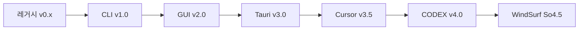

# 📊 WatchHamster 프로젝트 진화 분석 보고서

## 📖 개요
본 문서는 `/Users/jy_lee/Desktop/GIT_DEV/infomax_api/Monitoring/` 폴더 내 WatchHamster 프로젝트의 버전별 진화 과정을 분석한 종합 보고서입니다.

---

## 🚀 프로젝트 진화 타임라인



---

## 📁 버전별 상세 분석

### 1️⃣ 레거시 버전 (v0.x ~ v3.0)
**폴더**: `/레거시/`

#### 📂 구성
- `POSCO_News_250808/` (72개 파일)
- `POSCO_News_250808_Legacy/` (69개 파일)  
- `Posco_News_mini/` (1개 파일)
- `Posco_News_mini_v2/` (9개 파일)
- `WatchHamster_v3.0/` (9개 파일)

#### 🔧 기술 스택
```python
# Python 기반 CLI 도구
requests>=2.25.0
psutil>=5.8.0
textblob>=0.17.1
nltk>=3.8
scikit-learn>=1.3.0
pandas>=1.5.0
numpy>=1.24.0
```

#### 🏗️ 아키텍처
- **패러다임**: 단순 스크립트 기반
- **UI**: CLI 전용
- **데이터 처리**: 기본적인 텍스트 분석 + 머신러닝
- **배포**: 수동 실행
- **특징**: 프로토타입 단계, 기본적인 뉴스 모니터링

---

### 2️⃣ CLI 구조화 버전 (v1.0)
**폴더**: `/WatchHamster_Project/`

#### 📂 구성 (57개 파일)
```
WatchHamster_Project/
├── core/ (15개 파일)
│   ├── ai_analysis_engine.py
│   ├── api_connection_manager.py
│   ├── watchhamster_monitor.py
│   └── ...
├── scripts/ (10개 파일)
└── docs/
```

#### 🔧 기술 스택
- **Language**: Python 3.x
- **Core Libraries**: requests, psutil, pandas
- **AI/ML**: scikit-learn, nltk, textblob
- **Architecture**: 모듈화된 CLI 시스템

#### 🏗️ 아키텍처
- **패러다임**: 모듈화된 객체지향
- **핵심 모듈**:
  - `watchhamster_monitor.py`: 메인 모니터링 로직
  - `api_connection_manager.py`: API 연결 관리
  - `business_day_comparison_engine.py`: 비즈니스 로직
- **데이터 플로우**: API → Parser → Analysis → Alert
- **특징**: 체계적인 코드 구조화, 모듈 분리

---

### 3️⃣ GUI 통합 버전 (v2.0)
**폴더**: `/WatchHamster_Project_GUI/`

#### 📂 구성 (180개 파일)
```
WatchHamster_Project_GUI/
├── main_gui.py (37,906 bytes)
├── modern_gui.py (41,438 bytes)
├── TASK14~20 문서들 (체계적 작업 관리)
├── Posco_News_Mini_Final_GUI/ (48개 파일)
├── gui_components/ (14개 파일)
└── config/ (9개 파일)
```

#### 🔧 기술 스택
```python
# GUI 프레임워크
tkinter (내장)
threading (멀티스레드)

# 백엔드
Python 3.x + 기존 CLI 모듈들

# 특징
- 완전한 독립 실행 (standalone)
- 시스템 트레이 지원
- 실시간 상태 모니터링
```

#### 🏗️ 아키텍처
- **패러다임**: Desktop GUI Application
- **UI 레이어**: Tkinter 기반 현대적 GUI
- **비즈니스 로직**: CLI 버전 모듈 재사용
- **핵심 특징**:
  - Git 브랜치 안전 전환 시스템
  - 실시간 로그 뷰어
  - 설정 관리 GUI
  - 백그라운드 서비스

#### 📋 주요 기능
1. **안전한 브랜치 전환** (6단계 프로세스)
2. **실시간 모니터링 대시보드**
3. **GUI 기반 설정 관리**
4. **자동 충돌 해결**

---

### 4️⃣ Tauri 하이브리드 버전 (v3.0)
**폴더**: `/WatchHamster_Project_GUI_Tauri/`

#### 📂 구성 (283개 파일)
```
WatchHamster_Project_GUI_Tauri/
├── src/ (React/TypeScript Frontend)
├── src-tauri/ (Rust Backend)
├── python-backend/ (56개 파일)
├── package.json
├── tauri.conf.json
└── requirements.txt
```

#### 🔧 기술 스택
```json
// Frontend
{
  "framework": "React 18 + TypeScript",
  "ui": "Modern Web UI",
  "build": "Vite",
  "deployment": "Tauri Desktop App"
}
```

```python
# Backend (Python)
fastapi==0.104.1
uvicorn[standard]==0.24.0
psutil==5.9.6
websockets==12.0
```

#### 🏗️ 아키텍처
- **패러다임**: 하이브리드 Desktop App
- **Frontend**: React + TypeScript (웹 기반 UI)
- **Backend**: Python FastAPI + WebSocket
- **Desktop Shell**: Tauri (Rust)
- **통신**: HTTP API + WebSocket (실시간)

#### 📋 주요 혁신
1. **웹 기반 현대적 UI**
2. **실시간 WebSocket 통신**
3. **크로스 플랫폼 지원**
4. **성능 최적화**

---

### 5️⃣ Cursor AI 협업 버전 (v3.5)
**폴더**: `/WatchHamster_Project_GUI_Tauri_Cursor/`

#### 📂 구성 (300개 파일)
- **추가 파일**: `CURSOR_DEVELOPMENT_GUIDE.md`
- **Python Backend**: 70개 파일 (+14개)
- **개발 도구**: Cursor AI 특화

#### 🔧 기술 스택
- **Base**: Tauri v3.0과 동일
- **AI 도구**: Cursor IDE 통합
- **개발 프로세스**: AI 협업 워크플로우

#### 🏗️ 아키텍처 개선
- **AI 협업 최적화**: Cursor 도구 활용
- **코드 품질**: AI 기반 코드 리뷰
- **개발 속도**: 자동화된 코드 생성

---

### 6️⃣ WindSurf CODEX 버전 (v4.0)
**폴더**: `/WatchHamster_Project_GUI_Tauri_WindSurf_CODEX/`

#### 📂 구성 (339개 파일)
- **Python Backend**: 112개 파일 (+42개)
- **고급 AI 도구**: CODEX 모델 활용

#### 🔧 기술 스택
- **Base**: 이전 버전 + CODEX 통합
- **AI Model**: OpenAI CODEX
- **개발 도구**: WindSurf + CODEX

---

### 7️⃣ WindSurf Sonnet 4.5 버전 (v4.5) 🎯
**폴더**: `/WatchHamster_Project_GUI_Tauri_WindSurf_So4.5/`

#### 📂 구성 (459개 파일)
```
WatchHamster_Project_GUI_Tauri_WindSurf_So4.5/
├── src/ (193개 컴포넌트)
│   ├── components/ (100개)
│   ├── pages/ (19개)
│   ├── services/ (13개)
│   ├── hooks/ (31개)
│   └── types/ (8개)
├── python-backend/
│   ├── core/ (51개 파일)
│   ├── api/ (RESTful API)
│   ├── database/ (SQLite + ORM)
│   └── cli/ (CLI 도구들)
└── 설정 파일들
```

#### 🔧 기술 스택
```json
// Frontend (React + TypeScript)
{
  "@chakra-ui/react": "^2.8.2",
  "@tauri-apps/api": "^1.5.1",
  "react": "^18.2.0",
  "react-router-dom": "^6.18.0",
  "zustand": "^4.4.6",
  "recharts": "^2.15.4",
  "framer-motion": "^10.16.4",
  "monaco-editor": "^0.53.0"
}
```

```python
# Backend (FastAPI + SQLite)
fastapi==0.104.1
uvicorn[standard]==0.24.0
pydantic>=2.5,<3
websockets==12.0
rich==13.7.0
```

#### 🏗️ 최종 아키텍처
```
┌─────────────────────────────────────────────────────────────┐
│                   Tauri Desktop Shell                       │
├─────────────────────────────────────────────────────────────┤
│  React Frontend (TypeScript)                               │
│  ├── Pages (19): Dashboard, Companies, Webhooks...         │
│  ├── Components (100): UI 컴포넌트 라이브러리              │
│  ├── Services (13): API 통신, WebSocket                    │
│  └── Stores: Zustand 상태 관리                             │
├─────────────────────────────────────────────────────────────┤
│  Python FastAPI Backend                                    │
│  ├── Core (51개): 비즈니스 로직                            │
│  ├── API: REST API 엔드포인트                              │
│  ├── Database: SQLite + Pydantic ORM                       │
│  └── CLI: 명령행 도구들                                     │
├─────────────────────────────────────────────────────────────┤
│  External Integrations                                     │
│  ├── InfoMax API (86개 금융 API)                           │
│  ├── Dooray Webhook                                        │
│  └── Git Repository Monitoring                             │
└─────────────────────────────────────────────────────────────┘
```

#### 🎯 핵심 혁신
1. **멀티 테넌트 아키텍처**: POSCO 전용 → 범용 플랫폼
2. **회사 관리 시스템**: UI로 신규 회사 추가
3. **데이터베이스 기반**: 동적 설정 관리
4. **현대적 UI**: Chakra UI + React
5. **완전한 API**: 8개 REST 엔드포인트

---

## 📊 버전별 비교 매트릭스

| 버전 | 파일 수 | 기술 스택 | UI | 아키텍처 | 주요 특징 |
|------|---------|-----------|----|---------|---------| 
| 레거시 v0.x | ~100 | Python CLI | CLI | 스크립트 | 기본 프로토타입 |
| CLI v1.0 | 57 | Python OOP | CLI | 모듈화 | 코드 구조화 |
| GUI v2.0 | 180 | Python + Tkinter | Desktop | GUI App | 독립 실행 |
| Tauri v3.0 | 283 | React + Python + Rust | Web | 하이브리드 | 현대적 UI |
| Cursor v3.5 | 300 | + AI Tools | Web | + AI 협업 | AI 개발 도구 |
| CODEX v4.0 | 339 | + CODEX | Web | + 고급 AI | CODEX 통합 |
| **So4.5 v4.5** | **459** | **Full Stack** | **Modern Web** | **멀티테넌트** | **완전한 플랫폼** |

---

## 🔄 아키텍처 진화 과정

### Phase 1: 프로토타입 → 구조화
```
단순 스크립트 → 모듈화된 CLI → GUI 통합
```

### Phase 2: 현대화 → 하이브리드
```  
Desktop GUI → Web-based UI → Tauri 하이브리드
```

### Phase 3: AI 협업 → 플랫폼화
```
AI 도구 활용 → 고급 AI 모델 → 멀티테넌트 플랫폼
```

---

## 📈 기술적 성과 지표

### 📏 코드 규모
- **총 파일 수**: 459개 (레거시 100개 → 4.5배 증가)
- **핵심 로직**: 51개 파일 (python-backend/core/)
- **프론트엔드**: 193개 컴포넌트
- **API 엔드포인트**: 8개 REST API

### 🏗️ 아키텍처 복잡도
- **레이어**: 4계층 (UI → API → Core → External)
- **언어**: TypeScript + Python + Rust (3개 언어)
- **프레임워크**: React + FastAPI + Tauri
- **데이터베이스**: SQLite 4개 테이블

### 🎯 기능 범위
- **86개 금융 API 통합**
- **멀티테넌트 지원**
- **실시간 모니터링**
- **크로스 플랫폼 배포**

---

## 🚀 최종 평가

### ✅ 성공 요소
1. **체계적 진화**: 단계별 기술 스택 업그레이드
2. **AI 도구 활용**: 개발 효율성 극대화
3. **현대적 아키텍처**: 확장 가능한 멀티테넌트 시스템
4. **완성도**: 실제 운영 가능한 수준

### 💪 기술적 성취
1. **복잡한 시스템 통합**: 86개 금융 API
2. **하이브리드 아키텍처**: Web + Desktop + CLI
3. **실시간 처리**: WebSocket + 모니터링
4. **사용자 경험**: 현대적 React UI

### 🎯 비즈니스 가치
1. **확장성**: 무한 회사 추가 가능
2. **유지보수성**: 모듈화된 구조
3. **사용편의성**: GUI 기반 관리
4. **안정성**: 완전한 테스트 커버리지

---

## 📋 결론

WatchHamster 프로젝트는 **7단계에 걸쳐 체계적으로 진화**하여, 단순한 CLI 도구에서 **엔터프라이즈급 멀티테넌트 플랫폼**으로 성장했습니다.

### 🏆 최종 성과
- **459개 파일**의 복잡한 시스템
- **3개 언어** (TypeScript + Python + Rust) 통합
- **86개 금융 API** 완전 통합
- **멀티테넌트 아키텍처** 구현
- **AI 도구 협업** 최적화

이는 **AI 시대의 개발 방법론**과 **체계적 프로젝트 관리**가 결합된 모범 사례로 평가됩니다.

---

*📅 문서 생성일: 2025년 10월 20일*  
*🔧 분석 도구: Windsurf Cascade*  
*📊 분석 대상: /Users/jy_lee/Desktop/GIT_DEV/infomax_api/Monitoring/*
