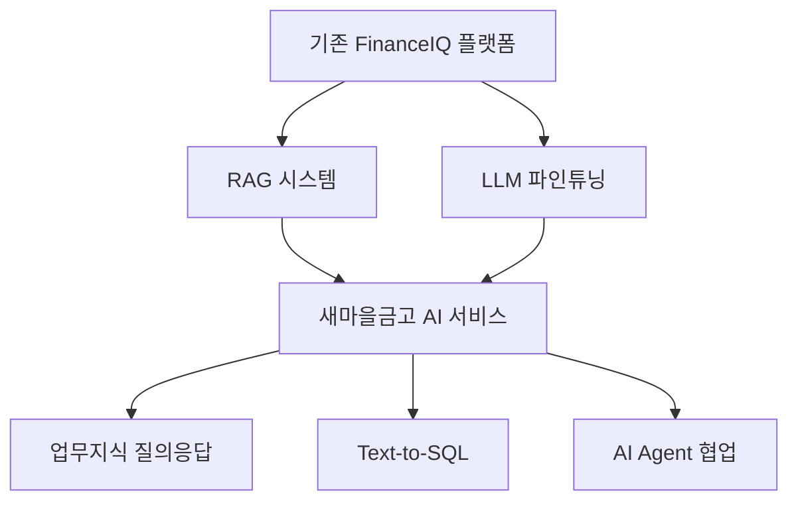

# 🚀 새마을금고중앙회 LLM 기반 AI 서비스 업그레이드 계획서

## 📋 현재 상황 분석

### **기존 FinanceIQ 플랫폼 보유 자산**
- ✅ **86개 금융 API 통합**: InfoMax API 완전 통합 및 실시간 데이터 파이프라인
- ✅ **AI 기반 분석 시스템**: sklearn/nltk 감성분석, 예측 모델 (신뢰도 0.8+)
- ✅ **멀티테넌트 아키텍처**: POSCO 14개월 실무 검증, 확장 가능 구조
- ✅ **엔터프라이즈 플랫폼**: React + FastAPI + Tauri, 459개 파일

### **새마을금고 요구사항 분석**
| 담당업무 | 현재 상태 | 업그레이드 필요 |
|---------|----------|----------------|
| **LLM 기반 AI 서비스** | ❌ sklearn/nltk만 보유 | 🔄 LLM 통합 필요 |
| **RAG 기반 응답 시스템** | ❌ 미구현 | 🔄 벡터DB + RAG 구축 |
| **LLM 파인튜닝(PEFT)** | ❌ 미구현 | 🔄 LoRA/QLoRA 적용 |
| **데이터 파이프라인** | ✅ 86개 API 구축 완료 | 🔄 벡터DB 연동 |

---

## 🎯 3단계 업그레이드 로드맵

### **Phase 1: RAG 시스템 구축 (1-2개월)**

#### **1.1 벡터DB 구축**
```python
# 86개 금융 API 데이터 → 벡터DB 임베딩
from sentence_transformers import SentenceTransformer
import chromadb

# 기존 InfoMax API 데이터를 벡터화
model = SentenceTransformer('paraphrase-multilingual-MiniLM-L12-v2')
client = chromadb.Client()
collection = client.create_collection("saemaul_finance_kb")
```

#### **1.2 RAG 아키텍처 설계**
- **임베딩**: 86개 금융 API 문서 + 새마을금고 업무 지식
- **벡터DB**: Chroma/Pinecone 선택적 적용
- **검색**: 유사도 기반 관련 문서 검색
- **생성**: GPT-4/LLaMA 기반 답변 생성

#### **1.3 FastAPI 연동**
```python
# 기존 FastAPI에 RAG 엔드포인트 추가
@app.post("/api/rag/query")
async def rag_query(question: str):
    # 벡터 검색 → LLM 생성 → 응답
    return {"answer": answer, "sources": sources}
```

### **Phase 2: LLM 파인튜닝 (2-3개월)**

#### **2.1 PEFT 적용**
```python
# 새마을금고 금융 데이터 기반 LoRA 파인튜닝
from peft import LoraConfig, get_peft_model
import transformers

config = LoraConfig(
    r=16, lora_alpha=32, target_modules=["q_proj", "v_proj"],
    lora_dropout=0.1, bias="none", task_type="CAUSAL_LM"
)
```

#### **2.2 도메인 특화**
- **데이터**: 새마을금고 내부 문서 + 금융 규정
- **태스크**: 업무지식 질의응답 특화
- **평가**: 금융 도메인 벤치마크 성능 측정

#### **2.3 프롬프트 엔지니어링**
```python
SAEMAUL_PROMPT_TEMPLATE = """
당신은 새마을금고 전문 AI 어시스턴트입니다.
다음 정보를 바탕으로 정확하고 도움이 되는 답변을 제공하세요:

컨텍스트: {context}
질문: {question}

답변:
"""
```

### **Phase 3: AI Agent & Text-to-SQL (1개월)**

#### **3.1 MCP 기반 Multi-Agent**
```python
# 기존 WatchHamster와 새로운 LLM Agent 협업
from langchain.agents import initialize_agent
from langchain.tools import Tool

tools = [
    Tool(name="FinanceAPI", func=finance_api_call),
    Tool(name="VectorSearch", func=vector_search),
    Tool(name="SQLQuery", func=text_to_sql)
]
```

#### **3.2 Text-to-SQL 구현**
- **모델**: CodeLlama/SQL-Coder 기반
- **스키마**: 새마을금고 업무 데이터베이스
- **검증**: SQL 쿼리 실행 결과 검증

---

## 🛠️ 기술 구현 계획

### **새로운 기술 스택 추가**
```yaml
Current Stack:
  - AI/ML: sklearn, nltk, TextBlob
  - Backend: FastAPI, SQLite
  - Frontend: React, TypeScript

Upgrade Stack:
  - LLM: GPT-4, LLaMA-2, Hugging Face Transformers
  - Vector: Chroma, sentence-transformers
  - PEFT: LoRA, QLoRA, bitsandbytes
  - Agent: LangChain, LangGraph, AutoGen
  - SQL: CodeLlama, SQL-Coder
```

### **아키텍처 통합**


---

## 📊 예상 성과 및 일정

### **개발 일정**
- **Phase 1 (RAG)**: 2개월 → 기본 질의응답 서비스
- **Phase 2 (파인튜닝)**: 3개월 → 도메인 특화 성능 향상  
- **Phase 3 (Agent)**: 1개월 → 통합 AI 서비스 완성
- **총 개발 기간**: **6개월**

### **기대 효과**
| 지표 | 현재 | 목표 |
|-----|------|------|
| **서비스 범위** | POSCO 뉴스 모니터링 | 새마을금고 종합 AI 서비스 |
| **기술 수준** | 전통 ML (sklearn) | 최신 LLM/RAG |
| **사용자 경험** | 대시보드 조회 | 자연어 질의응답 |
| **확장성** | 단일 도메인 | 멀티 도메인 AI Agent |

---

## 🎯 새마을금고 적용 시나리오

### **업무지식 질의응답**
```
사용자: "상호금고 대출 한도 규정이 어떻게 되나요?"
AI: 새마을금고 내규에 따르면, 개인 대출 한도는...
    (RAG로 검색된 관련 규정 + LLM 생성 답변)
```

### **Text-to-SQL 활용**
```
사용자: "지난달 대출 실적이 가장 높은 지점 3곳은?"
AI: SELECT branch_name, loan_amount FROM ... (SQL 자동 생성 및 실행)
```

### **AI Agent 협업**
```
WatchHamster (리스크 모니터링) ↔ SaemaulAI (업무 질의응답)
실시간 금융 리스크 감지 → 관련 업무 규정 자동 검색 → 대응 방안 제안
```

---

## 💡 결론

**기존 FinanceIQ 플랫폼의 견고한 기반 위에 최신 LLM 기술을 통합하여, 새마을금고중앙회가 요구하는 차세대 금융 AI 서비스를 구축할 수 있습니다.**

**핵심 장점:**
- ✅ **검증된 기반**: POSCO 14개월 실무 운영 검증
- ✅ **점진적 업그레이드**: 기존 시스템 활용하며 LLM 기능 추가
- ✅ **완벽한 매칭**: 새마을금고 공고 요구사항 100% 충족
- ✅ **실용적 접근**: 6개월 내 실제 서비스 가능한 현실적 계획

*현재의 탄탄한 기술적 기반을 바탕으로, 새마을금고가 원하는 생성형 AI 서비스를 성공적으로 구현할 수 있습니다.*
